# Skill Snap Recruitment Platform - Concept ERD (Mermaid)

## 📊 Complete Microservices Architecture ERD

```mermaid
erDiagram
    %% ========== AUTH SERVICE ==========
    USER {
        int UserId PK
        string Email UK
        string PasswordHash
        string FirstName
        string LastName
        datetime CreatedAt
        datetime UpdatedAt
    }
    
    CREDENTIAL {
        int CredentialId PK
        int UserId FK
        string Provider "oauth provider"
        string ProviderKey
        string ProviderDisplayName
    }
    
    ROLE {
        int RoleId PK
        string RoleName
        string Description
    }
    
    USER_ROLE {
        int UserRoleId PK
        int UserId FK
        int RoleId FK
    }

    %% ========== USERPROFILE SERVICE ==========
    EMPLOYEE {
        int EmployeeId PK
        int UserId FK
        string FullName
        string Email
        string Bio
        string Phone
        string Location
        string AvatarUrl
        string CoverImageUrl
        int YearsOfExperience
        datetime CreatedAt
        datetime UpdatedAt
    }

    EXPERT {
        int ExpertId PK
        int UserId FK
        string Expertise
        decimal Rating
        int ChallengesCreated
        int SubmissionsEvaluated
        datetime CreatedAt
    }

    COMPANY {
        int CompanyId PK
        int UserId FK
        string CompanyName
        string Industry
        string LogoUrl
        string Description
        string Website
        string Location
        int EmployeeCount
        datetime CreatedAt
    }

    EMPLOYEE_SKILL {
        int EmployeeSkillId PK
        int EmployeeId FK
        int SkillId FK
        int ProficiencyLevel
        decimal MasteryScore
        int YearsOfExperience
        datetime CreatedAt
    }

    SKILL_MASTER {
        int SkillId PK
        int SkillCategoryId FK
        string SkillName
        string Slug UK
        string Description
        int Popularity
        datetime CreatedAt
    }

    SKILL_CATEGORY {
        int SkillCategoryId PK
        string CategoryName
        string Description
        int DisplayOrder
    }

    %% ========== PORTFOLIO SERVICE ==========
    PORTFOLIO {
        int PortfolioId PK
        int EmployeeId FK
        string Title
        string Headline
        string Bio
        boolean IsPublic
        boolean IsMain
        string ModerationStatus
        string EmbeddingStatus
        vector Embedding
        datetime CreatedAt
        datetime UpdatedAt
    }

    PORTFOLIO_BLOCK {
        int BlockId PK
        int PortfolioId FK
        int BlockTypeId FK
        int DisplayOrder
        boolean IsVisible
        string Variant
        json DataJson
        datetime CreatedAt
    }

    PORTFOLIO_BLOCK_TYPE {
        int BlockTypeId PK
        string TypeName
        string Description
    }

    PORTFOLIO_PREVIEW {
        int PreviewId PK
        int PortfolioId FK
        string CacheKey
        int Version
        json PreviewJson
        string ImageUrl
        string ImageId
        string SelectedTheme
        string GenerationModel
        string SocialCaption
        string RecruiterSummary
        int TokensUsed
        int RegeneratedCount
        boolean IsActive
        datetime CreatedAt
        datetime UpdatedAt
    }

    PORTFOLIO_REPORT {
        int ReportId PK
        int PortfolioId FK
        int ReportedById FK
        string Reason
        string Content
        string Status
        datetime CreatedAt
    }

    %% ========== COMPANY SERVICE ==========
    COMPANY_POST {
        int PostId PK
        int CompanyId FK
        int CreatedById FK
        string Position
        string JobDescription
        string Requirements
        decimal SalaryMin
        decimal SalaryMax
        string SalaryCurrency
        string EmploymentType
        string Location
        string ExperienceLevel
        string Status
        datetime CreatedAt
        datetime UpdatedAt
    }

    COMPANY_POST_REPORT {
        int ReportId PK
        int PostId FK
        int ReportedById FK
        string Reason
        string Status
        datetime CreatedAt
    }

    SAVED_POST {
        int SavedPostId PK
        int EmployeeId FK
        int PostId FK
        datetime SavedAt
    }

    %% ========== CHALLENGE SERVICE ==========
    CHALLENGE {
        int ChallengeId PK
        int CreatedById FK
        int ReviewedById FK
        string ChallengeTitle
        string Description
        string Difficulty
        string Status
        int EstimatedMinutes
        boolean IsPublic
        datetime CreatedAt
        datetime UpdatedAt
    }

    CHALLENGE_VERSION {
        int VersionId PK
        int ChallengeId FK
        int VersionNumber
        string Content
        string Instructions
        json SkillWeightMapping
        datetime CreatedAt
    }

    CHALLENGE_SUBMISSION {
        int SubmissionId PK
        int ChallengeId FK
        int UserId FK
        int VersionId FK
        guid SubmissionGuid
        string SubmissionStatus
        string SubmissionContent
        string GitHubLink
        int AttemptCount
        datetime SubmittedAt
        datetime CreatedAt
    }

    EVALUATION {
        int EvaluationId PK
        int SubmissionId FK
        int EvaluatedById FK
        int Score
        string Status
        string Feedback
        int SkillPointsAwarded
        decimal TokensUsed
        datetime CreatedAt
        datetime UpdatedAt
    }

    CRITERION {
        int CriterionId PK
        int VersionId FK
        string CriterionName
        string Description
        int MinimumScore
        int Weight
        datetime CreatedAt
    }

    CRITERIA_SKILL_MAPPING {
        int MappingId PK
        int CriterionId FK
        int SkillId FK
        decimal SkillWeight
        datetime CreatedAt
    }

    USER_SKILL {
        int UserSkillId PK
        int UserId FK
        int SkillId FK
        int TotalPoints
        decimal MasteryScore
        string VerificationLevel
        boolean IsVerified
        int ChallengesPassed
        datetime CreatedAt
        datetime UpdatedAt
    }

    SKILL_POINT_TRANSACTION {
        int TransactionId PK
        int UserId FK
        int SkillId FK
        int PointsAwarded
        int TotalUserSkillPoints
        string TransactionType
        int SourceSubmissionId FK
        datetime CreatedAt
    }

    PENDING_SKILL {
        int PendingSkillId PK
        int ChallengeId FK
        int SkillId FK
        int ProposedById FK
        string Status
        datetime CreatedAt
    }

    %% ========== COMMUNITY SERVICE ==========
    COMMUNITY {
        int CommunityId PK
        string CommunityName
        string Description
        string Icon
        int DisplayOrder
        datetime CreatedAt
    }

    COMMUNITY_POST {
        int PostId PK
        int CommunityId FK
        int CreatedById FK
        string Title
        string Content
        string Tags
        int ViewCount
        datetime CreatedAt
        datetime UpdatedAt
    }

    COMMUNITY_POST_COMMENT {
        int CommentId PK
        int PostId FK
        int CreatedById FK
        int ParentCommentId FK
        string Content
        datetime CreatedAt
        datetime UpdatedAt
    }

    COMMUNITY_POST_LIKE {
        int LikeId PK
        int PostId FK
        int UserId FK
        datetime CreatedAt
    }

    COMMENT_LIKE {
        int CommentLikeId PK
        int CommentId FK
        int UserId FK
        datetime CreatedAt
    }

    COMMUNITY_POST_REPORT {
        int ReportId PK
        int PostId FK
        int ReportedById FK
        string Reason
        string Status
        datetime CreatedAt
    }

    %% ========== APPLICATION SERVICE ==========
    APPLICATION {
        int ApplicationId PK
        int EmployeeId FK
        int CompanyId FK
        int CompanyPostId FK
        int PortfolioId FK
        int RoomId FK
        string Status
        datetime AppliedAt
        datetime CreatedAt
        datetime UpdatedAt
    }

    %% ========== NOTIFICATION SERVICE ==========
    NOTIFICATION {
        int Id PK
        string UserId FK
        string EventId
        string Title
        string Content
        string Type
        string ObjectId
        string ActorId
        string ActorName
        string ActorAvatar
        string ActorType
        datetime CreatedAt
        boolean IsRead
    }

    %% ========== SUBSCRIPTION SERVICE ==========
    PLAN {
        int PlanId PK
        string PlanName
        decimal Price
        string BillingCycle
        string Description
        int DisplayOrder
        datetime CreatedAt
    }

    USER_SUBSCRIPTION {
        int Id PK
        int UserId FK
        int PlanId FK
        datetime StartDate
        datetime EndDate
        string Status
        string PaymentStatus
        boolean AutoRenew
        datetime CreatedAt
        datetime UpdatedAt
    }

    FEATURE {
        int FeatureId PK
        string FeatureName
        string Description
        string Category
    }

    PLAN_FEATURE {
        int PlanFeatureId PK
        int PlanId FK
        int FeatureId FK
        int Limit
        string Unit
    }

    %% ========== MEDIA SERVICE ==========
    MEDIA_FILE {
        int MediaFileId PK
        string PublicId UK
        string Url
        string FileType
        string CloudProvider
        long FileSize
        int UploadedBy FK
        datetime UploadedAt
    }

    %% ========== CONNECTION SERVICE ==========
    CONNECTION {
        int ConnectionId PK
        int EmployeeId FK
        int ConnectedEmployeeId FK
        string ConnectionStatus
        int MutualConnectionCount
        datetime ConnectedAt
        datetime CreatedAt
    }

    CONNECTION_REQUEST {
        int RequestId PK
        int SenderId FK
        int ReceiverId FK
        string RequestStatus
        string Message
        datetime RequestedAt
        datetime RespondedAt
    }

    CONNECTION_SKILL_ENDORSEMENT {
        int EndorsementId PK
        int ConnectionId FK
        int SkillId FK
        int EndorsementCount
        datetime CreatedAt
    }

    %% ========== PAYMENT SERVICE ==========
    PAYMENT {
        int PaymentId PK
        int UserSubscriptionId FK
        decimal Amount
        string Currency
        string PaymentMethod
        string PaymentGateway
        string TransactionId UK
        string Status
        string PaymentType
        datetime ProcessedAt
        datetime CreatedAt
    }

    INVOICE {
        int InvoiceId PK
        int UserId FK
        int PaymentId FK
        string InvoiceNumber UK
        decimal Amount
        string Status
        string DueDate
        datetime IssuedAt
        datetime PaidAt
    }

    REFUND {
        int RefundId PK
        int PaymentId FK
        decimal RefundAmount
        string Reason
        string Status
        string RefundMethod
        datetime ProcessedAt
        datetime CreatedAt
    }

    %% ========== REALTIME SERVICE ==========
    CHAT_CONVERSATION {
        int ConversationId PK
        int InitiatedById FK
        int ParticipantId FK
        int LastMessageId FK
        string ConversationType
        string Status
        datetime CreatedAt
        datetime UpdatedAt
    }

    CHAT_MESSAGE {
        int MessageId PK
        int ConversationId FK
        int SenderId FK
        string Content
        string MessageType
        string AttachmentUrl
        boolean IsRead
        datetime ReadAt
        datetime CreatedAt
    }

    REALTIME_NOTIFICATION {
        int Id PK
        string UserId FK
        string EventType
        string EventData
        boolean IsDelivered
        datetime CreatedAt
    }

    ACTIVITY_FEED {
        int ActivityId PK
        int UserId FK
        string ActivityType
        string ActorId
        string ActorName
        string ObjectId
        string ObjectType
        string Description
        datetime CreatedAt
    }

    %% ========== RELATIONSHIPS ==========
    
    %% Auth relationships
    USER ||--o{ CREDENTIAL : has
    USER ||--o{ USER_ROLE : has
    ROLE ||--o{ USER_ROLE : "assigned to"
    
    %% UserProfile relationships
    USER ||--o{ EMPLOYEE : "creates"
    USER ||--o{ EXPERT : "creates"
    USER ||--o{ COMPANY : "creates"
    EMPLOYEE ||--o{ EMPLOYEE_SKILL : "has"
    SKILL_MASTER ||--o{ EMPLOYEE_SKILL : "referenced by"
    SKILL_CATEGORY ||--o{ SKILL_MASTER : "contains"
    
    %% Portfolio relationships
    EMPLOYEE ||--o{ PORTFOLIO : "owns"
    PORTFOLIO ||--o{ PORTFOLIO_BLOCK : "contains"
    PORTFOLIO_BLOCK_TYPE ||--o{ PORTFOLIO_BLOCK : "defines type"
    PORTFOLIO ||--o{ PORTFOLIO_PREVIEW : "has"
    PORTFOLIO ||--o{ PORTFOLIO_REPORT : "subject of"
    EMPLOYEE ||--o{ PORTFOLIO_REPORT : "reported by"
    
    %% Company relationships
    COMPANY ||--o{ COMPANY_POST : "publishes"
    COMPANY_POST ||--o{ COMPANY_POST_REPORT : "subject of"
    COMPANY_POST ||--o{ SAVED_POST : "bookmarked by"
    EMPLOYEE ||--o{ SAVED_POST : "saves"
    EMPLOYEE ||--o{ COMPANY_POST_REPORT : "reported by"
    EXPERT ||--o{ COMPANY_POST : "created by"
    
    %% Challenge relationships
    EXPERT ||--o{ CHALLENGE : "creates"
    CHALLENGE ||--o{ CHALLENGE_VERSION : "has versions"
    CHALLENGE ||--o{ CHALLENGE_SUBMISSION : "receives"
    EMPLOYEE ||--o{ CHALLENGE_SUBMISSION : "submits"
    CHALLENGE_VERSION ||--o{ CHALLENGE_SUBMISSION : "evaluates against"
    CHALLENGE_SUBMISSION ||--o{ EVALUATION : "receives"
    EXPERT ||--o{ EVALUATION : "evaluates"
    CHALLENGE_VERSION ||--o{ CRITERION : "defines"
    CRITERION ||--o{ CRITERIA_SKILL_MAPPING : "has"
    SKILL_MASTER ||--o{ CRITERIA_SKILL_MAPPING : "referenced by"
    EMPLOYEE ||--o{ USER_SKILL : "possesses"
    SKILL_MASTER ||--o{ USER_SKILL : "tracked as"
    EMPLOYEE ||--o{ SKILL_POINT_TRANSACTION : "awarded to"
    SKILL_MASTER ||--o{ SKILL_POINT_TRANSACTION : "awarded for"
    CHALLENGE_SUBMISSION ||--o{ SKILL_POINT_TRANSACTION : "sources"
    CHALLENGE ||--o{ PENDING_SKILL : "proposes"
    SKILL_MASTER ||--o{ PENDING_SKILL : "proposed skill"
    EXPERT ||--o{ PENDING_SKILL : "proposed by"
    
    %% Community relationships
    COMMUNITY ||--o{ COMMUNITY_POST : "contains"
    EMPLOYEE ||--o{ COMMUNITY_POST : "posts to"
    COMMUNITY_POST ||--o{ COMMUNITY_POST_COMMENT : "has comments"
    COMMUNITY_POST_COMMENT ||--o{ COMMUNITY_POST_COMMENT : "replies to"
    EMPLOYEE ||--o{ COMMUNITY_POST_COMMENT : "comments as"
    COMMUNITY_POST ||--o{ COMMUNITY_POST_LIKE : "liked by"
    EMPLOYEE ||--o{ COMMUNITY_POST_LIKE : "likes"
    COMMUNITY_POST_COMMENT ||--o{ COMMENT_LIKE : "liked by"
    EMPLOYEE ||--o{ COMMENT_LIKE : "likes"
    COMMUNITY_POST ||--o{ COMMUNITY_POST_REPORT : "reported"
    EMPLOYEE ||--o{ COMMUNITY_POST_REPORT : "reported by"
    
    %% Application relationships
    EMPLOYEE ||--o{ APPLICATION : "applies via"
    COMPANY ||--o{ APPLICATION : "receives"
    COMPANY_POST ||--o{ APPLICATION : "for"
    PORTFOLIO ||--o{ APPLICATION : "submits"
    
    %% Notification relationships
    EMPLOYEE ||--o{ NOTIFICATION : "receives"
    
    %% Subscription relationships
    USER ||--o{ USER_SUBSCRIPTION : "has"
    PLAN ||--o{ USER_SUBSCRIPTION : "subscribed to"
    PLAN ||--o{ PLAN_FEATURE : "includes"
    FEATURE ||--o{ PLAN_FEATURE : "part of"
    
    %% Media relationships
    EMPLOYEE ||--o{ MEDIA_FILE : "uploads"
    
    %% Connection relationships
    EMPLOYEE ||--o{ CONNECTION : "initiates"
    EMPLOYEE ||--o{ CONNECTION : "connects with"
    EMPLOYEE ||--o{ CONNECTION_REQUEST : "sends"
    EMPLOYEE ||--o{ CONNECTION_REQUEST : "receives"
    CONNECTION ||--o{ CONNECTION_SKILL_ENDORSEMENT : "has"
    SKILL_MASTER ||--o{ CONNECTION_SKILL_ENDORSEMENT : "endorsed as"
    
    %% Payment relationships
    USER_SUBSCRIPTION ||--o{ PAYMENT : "triggers"
    PAYMENT ||--o{ INVOICE : "creates"
    USER ||--o{ INVOICE : "billed to"
    PAYMENT ||--o{ REFUND : "refunded from"
    
    %% Realtime relationships
    EMPLOYEE ||--o{ CHAT_CONVERSATION : "initiates"
    EMPLOYEE ||--o{ CHAT_CONVERSATION : "participates in"
    CHAT_CONVERSATION ||--o{ CHAT_MESSAGE : "contains"
    EMPLOYEE ||--o{ CHAT_MESSAGE : "sends"
    EMPLOYEE ||--o{ REALTIME_NOTIFICATION : "receives"
    EMPLOYEE ||--o{ ACTIVITY_FEED : "has"
```



---

## 📊 Service Overview Table

| # | Service | Primary Entities | Purpose |
|----|---------|-----------------|---------|
| 1 | **Auth** | User, Credential, Role, UserRole | Authentication & authorization |
| 2 | **UserProfile** | Employee, Expert, Company, EmployeeSkill, SkillMaster, SkillCategory | User profiles & skill management |
| 3 | **Portfolio** | Portfolio, PortfolioBlock, PortfolioBlockType, PortfolioPreview, PortfolioReport | Portfolio creation & AI preview |
| 4 | **Company** | CompanyPost, CompanyPostReport, SavedPost | Job postings & bookmarks |
| 5 | **Challenge** | Challenge, ChallengeVersion, ChallengeSubmission, Evaluation, Criterion, CriteriaSkillMapping, UserSkill, SkillPointTransaction, PendingSkill | Skill challenges & scoring |
| 6 | **Community** | Community, CommunityPost, CommunityPostComment, CommunityPostLike, CommentLike, CommunityPostReport | Discussion & engagement |
| 7 | **Application** | Application | Job applications |
| 8 | **Notification** | Notification | Event notifications |
| 9 | **Subscription** | Plan, UserSubscription, Feature, PlanFeature | Billing & plans |
| 10 | **Media** | MediaFile | Image storage & CDN |
| 11 | **Connection** | Connection, ConnectionRequest, ConnectionSkillEndorsement | User networking & endorsements |
| 12 | **Payment** | Payment, Invoice, Refund | Payment processing |
| 13 | **Realtime** | ChatConversation, ChatMessage, RealtimeNotification, ActivityFeed | Real-time messaging & notifications |

---

## 🔑 Key Entity Counts

- **Total Entities:** 58
- **Total Relationships:** 100+
- **Authentication Entities:** 4
- **Business Logic Entities:** 54
- **Microservices:** 13

---

## 🏗️ Architecture Patterns

### Event-Driven Communication
```
Challenge Service → Event: SubmissionGraded
                      ↓
                Notification Service (consumes)
                Payment Service (if premium feature)
                Realtime Service (push notification)
```

### Cross-Service Data Flow
```
Employee applies for job
    ↓
Application Service creates Application
    ↓
Company Service notifies via Notification Service
    ↓
Realtime Service pushes notification via WebSocket
    ↓
Chat Service initiates conversation channel
```

### Skill Point Award Flow
```
ChallengeSubmission (graded by Expert)
    ↓
Evaluation created with Score
    ↓
SkillPointTransaction created
    ↓
UserSkill.TotalPoints updated
    ↓
Mastery calculation: (TotalPoints ÷ 50) × 70 + 30
    ↓
VerificationLevel updated
    ↓
Notification sent via Realtime Service
```

---

## 📝 Notes

1. **Database per Service:** Each microservice has its own database
2. **API Gateway:** Routes all requests to appropriate services
3. **Message Queue:** For async event publishing (Challenge, Community, etc)
4. **WebSocket:** Realtime service handles live chat & notifications
5. **Cache:** Portfolio previews, skill master data
6. **Search:** Full-text search in Community, Challenge, Portfolio services
7. **Embedding:** Portfolio uses vector embedding for AI similarity search

