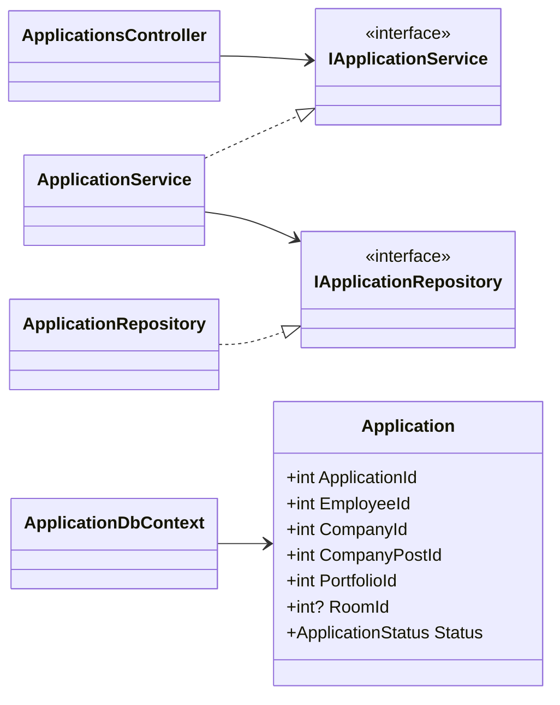

```mermaid
classDiagram
direction LR

class Application {
  +int ApplicationId
  +int EmployeeId
  +int CompanyId
  +int CompanyPostId
  +int PortfolioId
  +int? RoomId
  +ApplicationStatus Status
}

class ApplicationsController
class IApplicationService {
  <<interface>>
}
class ApplicationService
class IApplicationRepository {
  <<interface>>
}
class ApplicationRepository
class ApplicationDbContext

ApplicationsController --> IApplicationService
ApplicationService ..|> IApplicationService
ApplicationService --> IApplicationRepository
ApplicationRepository ..|> IApplicationRepository
ApplicationDbContext --> Application
```
