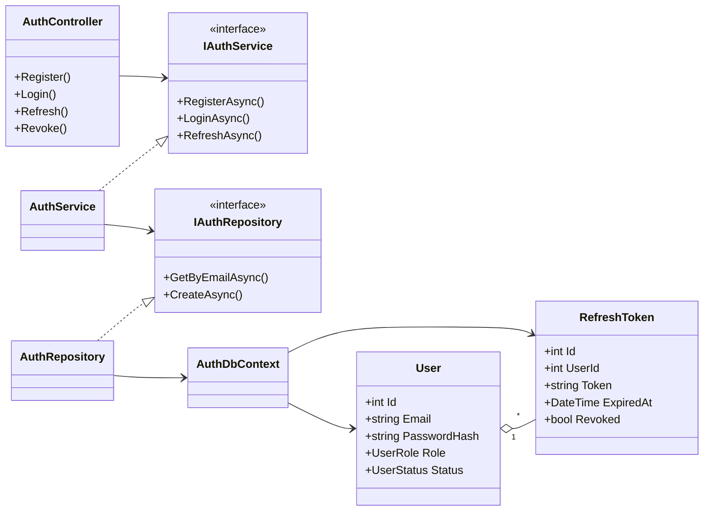

```mermaid
classDiagram
direction LR

class User {
  +int Id
  +string Email
  +string PasswordHash
  +UserRole Role
  +UserStatus Status
}

class RefreshToken {
  +int Id
  +int UserId
  +string Token
  +DateTime ExpiredAt
  +bool Revoked
}

class AuthController {
  +Register()
  +Login()
  +Refresh()
  +Revoke()
}

class IAuthService {
  <<interface>>
  +RegisterAsync()
  +LoginAsync()
  +RefreshAsync()
}

class AuthService
class IAuthRepository {
  <<interface>>
  +GetByEmailAsync()
  +CreateAsync()
}
class AuthRepository
class AuthDbContext

AuthController --> IAuthService
AuthService ..|> IAuthService
AuthService --> IAuthRepository
AuthRepository ..|> IAuthRepository
AuthRepository --> AuthDbContext
AuthDbContext --> User
AuthDbContext --> RefreshToken
User "1" o-- "*" RefreshToken
```
