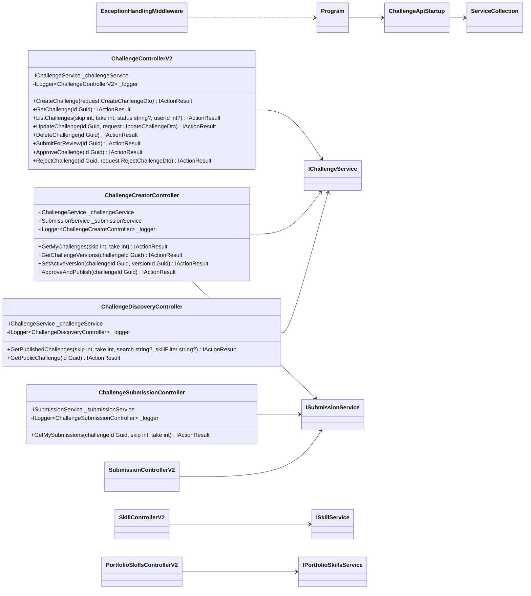

```mermaid
classDiagram
direction LR

%% API Layer - Controllers & Middleware
class ChallengeControllerV2 {
  -IChallengeService _challengeService
  -ILogger~ChallengeControllerV2~ _logger
  +CreateChallenge(request CreateChallengeDto) IActionResult
  +GetChallenge(id Guid) IActionResult
  +ListChallenges(skip int, take int, status string?, userId int?) IActionResult
  +UpdateChallenge(id Guid, request UpdateChallengeDto) IActionResult
  +DeleteChallenge(id Guid) IActionResult
  +SubmitForReview(id Guid) IActionResult
  +ApproveChallenge(id Guid) IActionResult
  +RejectChallenge(id Guid, request RejectChallengeDto) IActionResult
}

class ChallengeCreatorController {
  -IChallengeService _challengeService
  -ISubmissionService _submissionService
  -ILogger~ChallengeCreatorController~ _logger
  +GetMyChallenges(skip int, take int) IActionResult
  +GetChallengeVersions(challengeId Guid) IActionResult
  +SetActiveVersion(challengeId Guid, versionId Guid) IActionResult
  +ApproveAndPublish(challengeId Guid) IActionResult
}

class ChallengeDiscoveryController {
  -IChallengeService _challengeService
  -ILogger~ChallengeDiscoveryController~ _logger
  +GetPublishedChallenges(skip int, take int, search string?, skillFilter string?) IActionResult
  +GetPublicChallenge(id Guid) IActionResult
}

class ChallengeSubmissionController {
  -ISubmissionService _submissionService
  -ILogger~ChallengeSubmissionController~ _logger
  +GetMySubmissions(challengeId Guid, skip int, take int) IActionResult
}

class SubmissionControllerV2
class SkillControllerV2
class PortfolioSkillsControllerV2

class ExceptionHandlingMiddleware
class Program
class ChallengeApiStartup

ChallengeControllerV2 --> IChallengeService
ChallengeCreatorController --> IChallengeService
ChallengeCreatorController --> ISubmissionService
ChallengeDiscoveryController --> IChallengeService
ChallengeSubmissionController --> ISubmissionService

SubmissionControllerV2 --> ISubmissionService
SkillControllerV2 --> ISkillService
PortfolioSkillsControllerV2 --> IPortfolioSkillsService

Program --> ChallengeApiStartup
ChallengeApiStartup --> ServiceCollection
ExceptionHandlingMiddleware ..> Program

```