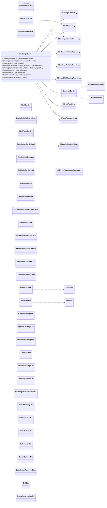

```mermaid
classDiagram
direction LR

%% Application Layer - Services, Interfaces, DTOs, Helpers
class IChallengeService {
  <<interface>>
}
class ChallengeService {
  -IChallengeRepository _challengeRepository
  -IChallengeVersionRepository _versionRepository
  -ISkillRepository _skillRepository
  -IEvaluationCriteriaRepository _evaluationCriteriaRepository
  -IChallengeCriteriaRepository _challengeCriteria_repository
  -IGeminiAIService _geminiAIService
  -IEventPublisher _eventPublisher
  -IActorResolverClient _actorResolverClient
  -ILogger~ChallengeService~ _logger
}

class ISubmissionService
class SubmissionServiceImpl
class ISkillService
class SkillServiceImpl
class ISkillPointService
class SkillPointServiceImpl
class IPortfolioSkillsService
class PortfolioSkillsServiceImpl
class IGradingService
class GradingServiceImpl
class ISubmissionGradingOrchestrator
class ISkillPointEngine
class ISkillNormalizationService
class IPromptSanitizationService
class IGeminiAIService
class GeminiAIServiceReal
class GeminiAIService
class IChallengeExpirationJob
class ChallengeExpirationJob

class ClaimExtractor
class ResultModels

class CreateChallengeDto
class UpdateChallengeDto
class ModerateChallengeDto
class ChallengeDto
class CreatorChallengeDto
class ChallengeVersionDto
class ChallengeVersionCriteriaDto
class PublicChallengeDto
class PublicVersionDto
class PublicCriteriaDto
class SubmissionDto
class SubmitSolutionDto
class SubmissionResponseDtos
class SkillDto
class PortfolioIntegrationDto

%% Relations
ChallengeService --> IChallengeRepository
ChallengeService --> IChallengeVersionRepository
ChallengeService --> ISkillRepository
ChallengeService --> IEvaluationCriteriaRepository
ChallengeService --> IChallengeCriteriaRepository
ChallengeService --> ICriteriaSkillMappingRepository
ChallengeService --> IGeminiAIService
ChallengeService --> IEventPublisher
ChallengeService --> IActorResolverClient

SubmissionServiceImpl --> ISubmissionRepository
SkillServiceImpl --> ISkillRepository
SkillPointServiceImpl --> ISkillPointTransactionRepository
PortfolioSkillsServiceImpl --> IActorResolverClient

IGeminiAIService <|.. GeminiAIServiceReal
IGeminiAIService <|.. GeminiAIService

ClaimExtractor ..> Controllers
ResultModels ..> Services

```