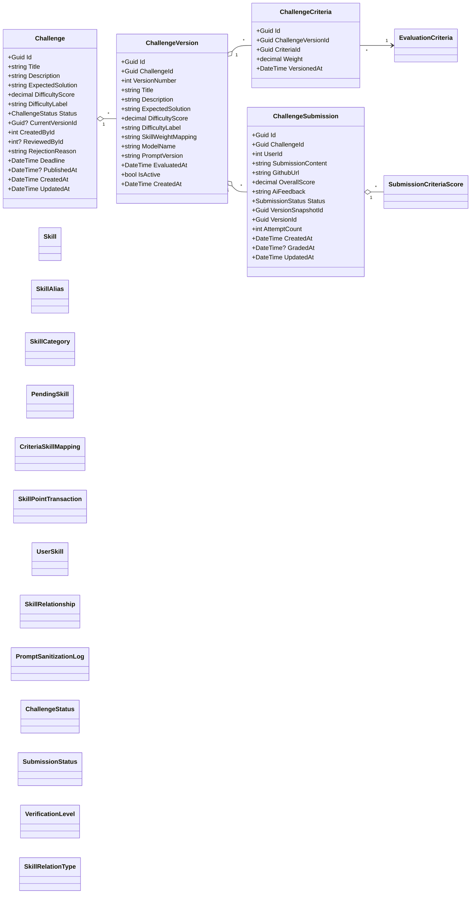

```mermaid
classDiagram
direction LR

%% Domain Layer - Entities & Enums
class Challenge {
  +Guid Id
  +string Title
  +string Description
  +string ExpectedSolution
  +decimal DifficultyScore
  +string DifficultyLabel
  +ChallengeStatus Status
  +Guid? CurrentVersionId
  +int CreatedById
  +int? ReviewedById
  +string RejectionReason
  +DateTime Deadline
  +DateTime? PublishedAt
  +DateTime CreatedAt
  +DateTime UpdatedAt
}

class ChallengeVersion {
  +Guid Id
  +Guid ChallengeId
  +int VersionNumber
  +string Title
  +string Description
  +string ExpectedSolution
  +decimal DifficultyScore
  +string DifficultyLabel
  +string SkillWeightMapping
  +string ModelName
  +string PromptVersion
  +DateTime EvaluatedAt
  +bool IsActive
  +DateTime CreatedAt
}

class ChallengeCriteria {
  +Guid Id
  +Guid ChallengeVersionId
  +Guid CriteriaId
  +decimal Weight
  +DateTime VersionedAt
}

class ChallengeSubmission {
  +Guid Id
  +Guid ChallengeId
  +int UserId
  +string SubmissionContent
  +string GithubUrl
  +decimal OverallScore
  +string AiFeedback
  +SubmissionStatus Status
  +Guid VersionSnapshotId
  +Guid VersionId
  +int AttemptCount
  +DateTime CreatedAt
  +DateTime? GradedAt
  +DateTime UpdatedAt
}

class SubmissionCriteriaScore
class EvaluationCriteria
class Skill
class SkillAlias
class SkillCategory
class PendingSkill
class CriteriaSkillMapping
class SkillPointTransaction
class UserSkill
class SkillRelationship
class PromptSanitizationLog

class ChallengeStatus
class SubmissionStatus
class VerificationLevel
class SkillRelationType

%% Relations
Challenge "1" o-- "*" ChallengeVersion
ChallengeVersion "1" o-- "*" ChallengeCriteria
ChallengeVersion "1" o-- "*" ChallengeSubmission
ChallengeCriteria "*" --> "1" EvaluationCriteria
ChallengeSubmission "1" o-- "*" SubmissionCriteriaScore

```