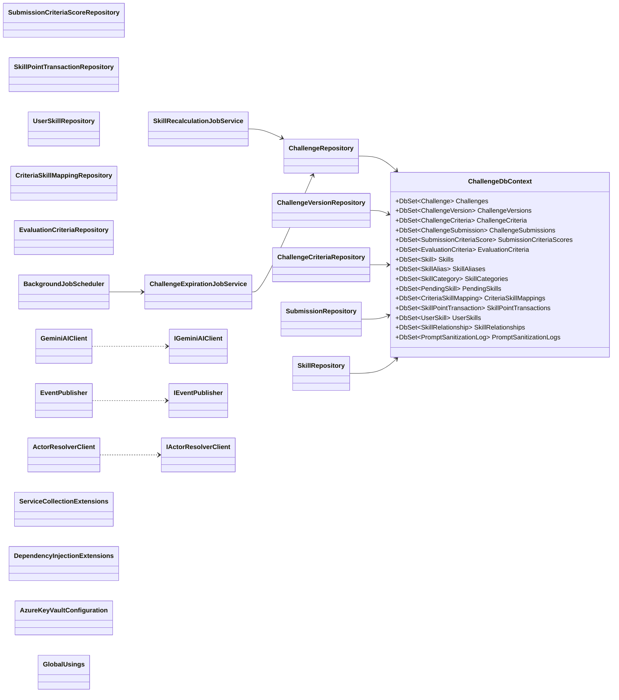

```mermaid
classDiagram
direction LR

%% Infrastructure Layer - Repositories, Clients, Jobs, DbContext
class ChallengeDbContext {
  +DbSet~Challenge~ Challenges
  +DbSet~ChallengeVersion~ ChallengeVersions
  +DbSet~ChallengeCriteria~ ChallengeCriteria
  +DbSet~ChallengeSubmission~ ChallengeSubmissions
  +DbSet~SubmissionCriteriaScore~ SubmissionCriteriaScores
  +DbSet~EvaluationCriteria~ EvaluationCriteria
  +DbSet~Skill~ Skills
  +DbSet~SkillAlias~ SkillAliases
  +DbSet~SkillCategory~ SkillCategories
  +DbSet~PendingSkill~ PendingSkills
  +DbSet~CriteriaSkillMapping~ CriteriaSkillMappings
  +DbSet~SkillPointTransaction~ SkillPointTransactions
  +DbSet~UserSkill~ UserSkills
  +DbSet~SkillRelationship~ SkillRelationships
  +DbSet~PromptSanitizationLog~ PromptSanitizationLogs
}

class ChallengeRepository
class ChallengeVersionRepository
class ChallengeCriteriaRepository
class SubmissionRepository
class SubmissionCriteriaScoreRepository
class SkillRepository
class SkillPointTransactionRepository
class UserSkillRepository
class CriteriaSkillMappingRepository
class EvaluationCriteriaRepository

class GeminiAIClient
class EventPublisher
class ActorResolverClient

class SkillRecalculationJobService
class ChallengeExpirationJobService
class BackgroundJobScheduler
class ServiceCollectionExtensions
class DependencyInjectionExtensions
class AzureKeyVaultConfiguration
class GlobalUsings

%% Relations
ChallengeRepository --> ChallengeDbContext
ChallengeVersionRepository --> ChallengeDbContext
ChallengeCriteriaRepository --> ChallengeDbContext
SubmissionRepository --> ChallengeDbContext
SkillRepository --> ChallengeDbContext

GeminiAIClient ..> IGeminiAIClient
EventPublisher ..> IEventPublisher
ActorResolverClient ..> IActorResolverClient

SkillRecalculationJobService --> ChallengeRepository
ChallengeExpirationJobService --> ChallengeRepository
BackgroundJobScheduler --> ChallengeExpirationJobService

```