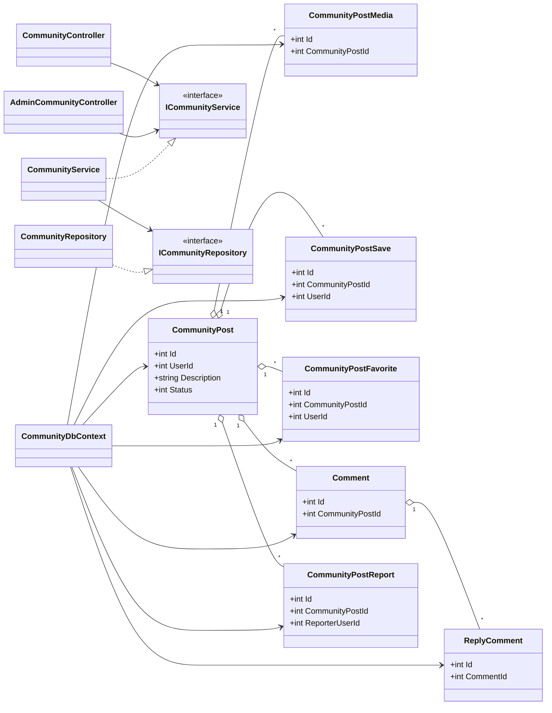

```mermaid
classDiagram
direction LR

class CommunityPost {
  +int Id
  +int UserId
  +string Description
  +int Status
}
class CommunityPostMedia {
  +int Id
  +int CommunityPostId
}
class CommunityPostSave {
  +int Id
  +int CommunityPostId
  +int UserId
}
class CommunityPostFavorite {
  +int Id
  +int CommunityPostId
  +int UserId
}
class Comment {
  +int Id
  +int CommunityPostId
}
class ReplyComment {
  +int Id
  +int CommentId
}
class CommunityPostReport {
  +int Id
  +int CommunityPostId
  +int ReporterUserId
}

class CommunityController
class AdminCommunityController
class ICommunityService {
  <<interface>>
}
class CommunityService
class ICommunityRepository {
  <<interface>>
}
class CommunityRepository
class CommunityDbContext

CommunityPost "1" o-- "*" CommunityPostMedia
CommunityPost "1" o-- "*" CommunityPostSave
CommunityPost "1" o-- "*" CommunityPostFavorite
CommunityPost "1" o-- "*" Comment
Comment "1" o-- "*" ReplyComment
CommunityPost "1" o-- "*" CommunityPostReport

CommunityController --> ICommunityService
AdminCommunityController --> ICommunityService
CommunityService ..|> ICommunityService
CommunityService --> ICommunityRepository
CommunityRepository ..|> ICommunityRepository
CommunityDbContext --> CommunityPost
CommunityDbContext --> CommunityPostMedia
CommunityDbContext --> CommunityPostSave
CommunityDbContext --> CommunityPostFavorite
CommunityDbContext --> Comment
CommunityDbContext --> ReplyComment
CommunityDbContext --> CommunityPostReport
```
