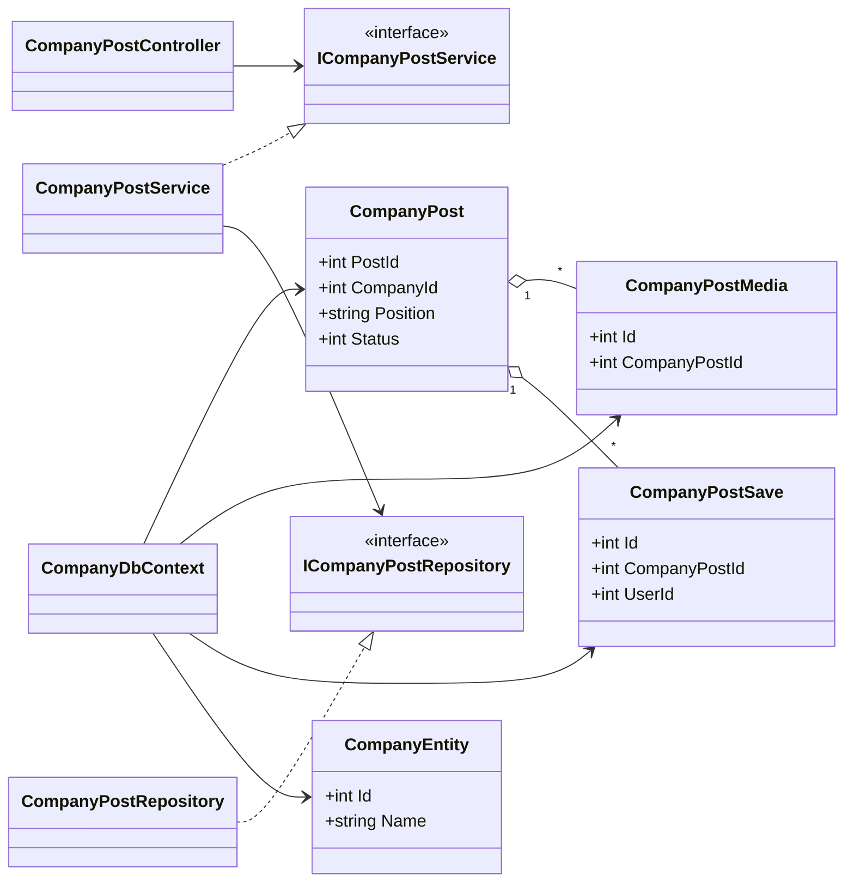

```mermaid
classDiagram
direction LR

class CompanyPost {
  +int PostId
  +int CompanyId
  +string Position
  +int Status
}
class CompanyPostMedia {
  +int Id
  +int CompanyPostId
}
class CompanyPostSave {
  +int Id
  +int CompanyPostId
  +int UserId
}
class CompanyEntity {
  +int Id
  +string Name
}

class CompanyPostController
class ICompanyPostService {
  <<interface>>
}
class CompanyPostService
class ICompanyPostRepository {
  <<interface>>
}
class CompanyPostRepository
class CompanyDbContext

CompanyPost "1" o-- "*" CompanyPostMedia
CompanyPost "1" o-- "*" CompanyPostSave

CompanyPostController --> ICompanyPostService
CompanyPostService ..|> ICompanyPostService
CompanyPostService --> ICompanyPostRepository
CompanyPostRepository ..|> ICompanyPostRepository
CompanyDbContext --> CompanyPost
CompanyDbContext --> CompanyPostMedia
CompanyDbContext --> CompanyPostSave
CompanyDbContext --> CompanyEntity
```
