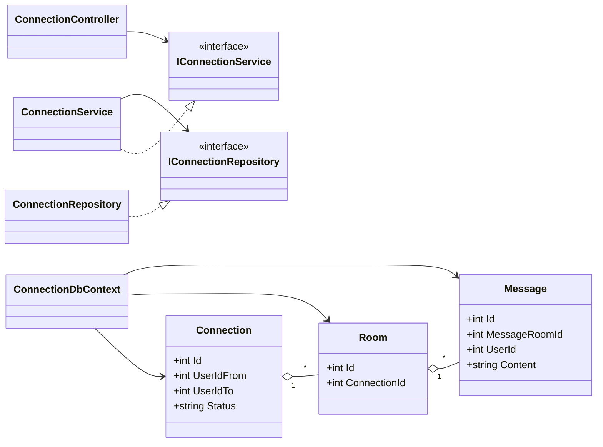

```mermaid
classDiagram
direction LR

class Connection {
  +int Id
  +int UserIdFrom
  +int UserIdTo
  +string Status
}
class Room {
  +int Id
  +int ConnectionId
}
class Message {
  +int Id
  +int MessageRoomId
  +int UserId
  +string Content
}

class ConnectionController
class IConnectionService {
  <<interface>>
}
class ConnectionService
class IConnectionRepository {
  <<interface>>
}
class ConnectionRepository
class ConnectionDbContext

Connection "1" o-- "*" Room
Room "1" o-- "*" Message

ConnectionController --> IConnectionService
ConnectionService ..|> IConnectionService
ConnectionService --> IConnectionRepository
ConnectionRepository ..|> IConnectionRepository
ConnectionDbContext --> Connection
ConnectionDbContext --> Room
ConnectionDbContext --> Message
```
