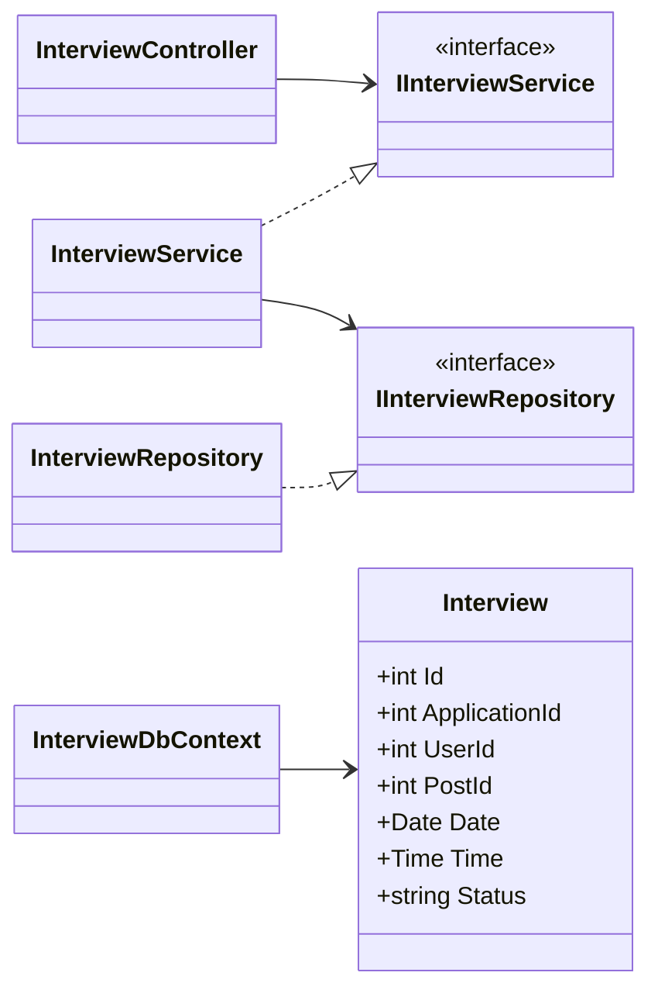

```mermaid
classDiagram
direction LR

class Interview {
  +int Id
  +int ApplicationId
  +int UserId
  +int PostId
  +Date Date
  +Time Time
  +string Status
}

class InterviewController
class IInterviewService {
  <<interface>>
}
class InterviewService
class IInterviewRepository {
  <<interface>>
}
class InterviewRepository
class InterviewDbContext

InterviewController --> IInterviewService
InterviewService ..|> IInterviewService
InterviewService --> IInterviewRepository
InterviewRepository ..|> IInterviewRepository
InterviewDbContext --> Interview
```
