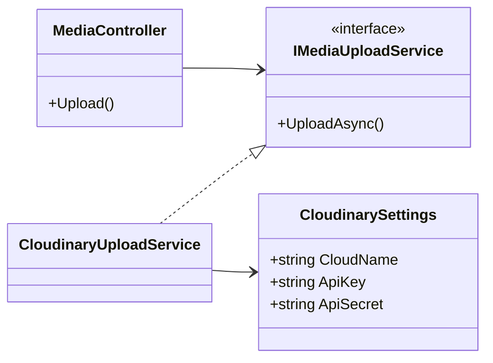

```mermaid
classDiagram
direction LR

class MediaController {
  +Upload()
}
class IMediaUploadService {
  <<interface>>
  +UploadAsync()
}
class CloudinaryUploadService
class CloudinarySettings {
  +string CloudName
  +string ApiKey
  +string ApiSecret
}

MediaController --> IMediaUploadService
CloudinaryUploadService ..|> IMediaUploadService
CloudinaryUploadService --> CloudinarySettings
```
