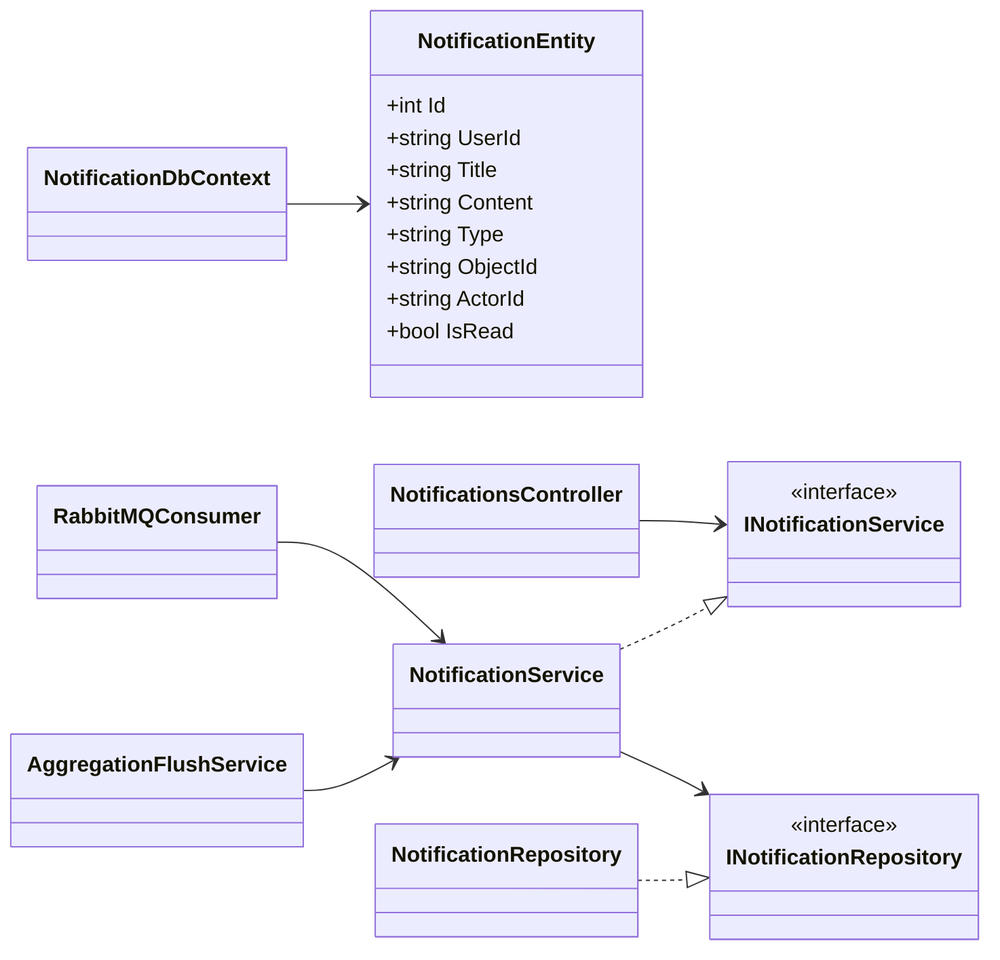

```mermaid
classDiagram
direction LR

class NotificationEntity {
  +int Id
  +string UserId
  +string Title
  +string Content
  +string Type
  +string ObjectId
  +string ActorId
  +bool IsRead
}

class NotificationsController
class INotificationService {
  <<interface>>
}
class NotificationService
class INotificationRepository {
  <<interface>>
}
class NotificationRepository
class RabbitMQConsumer
class AggregationFlushService
class NotificationDbContext

NotificationsController --> INotificationService
NotificationService ..|> INotificationService
NotificationService --> INotificationRepository
NotificationRepository ..|> INotificationRepository
RabbitMQConsumer --> NotificationService
AggregationFlushService --> NotificationService
NotificationDbContext --> NotificationEntity
```
