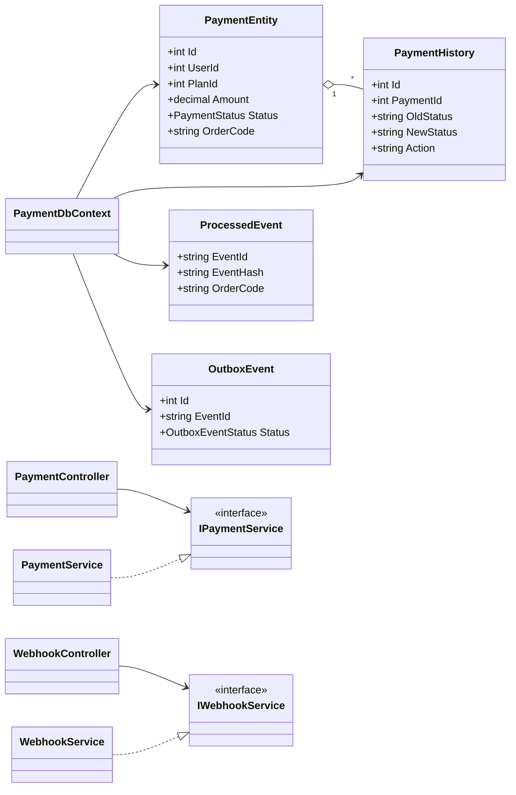

```mermaid
classDiagram
direction LR

class PaymentEntity {
  +int Id
  +int UserId
  +int PlanId
  +decimal Amount
  +PaymentStatus Status
  +string OrderCode
}
class PaymentHistory {
  +int Id
  +int PaymentId
  +string OldStatus
  +string NewStatus
  +string Action
}
class ProcessedEvent {
  +string EventId
  +string EventHash
  +string OrderCode
}
class OutboxEvent {
  +int Id
  +string EventId
  +OutboxEventStatus Status
}

class PaymentController
class WebhookController
class IPaymentService {
  <<interface>>
}
class PaymentService
class IWebhookService {
  <<interface>>
}
class WebhookService
class PaymentDbContext

PaymentEntity "1" o-- "*" PaymentHistory
PaymentController --> IPaymentService
WebhookController --> IWebhookService
PaymentService ..|> IPaymentService
WebhookService ..|> IWebhookService
PaymentDbContext --> PaymentEntity
PaymentDbContext --> PaymentHistory
PaymentDbContext --> ProcessedEvent
PaymentDbContext --> OutboxEvent
```
