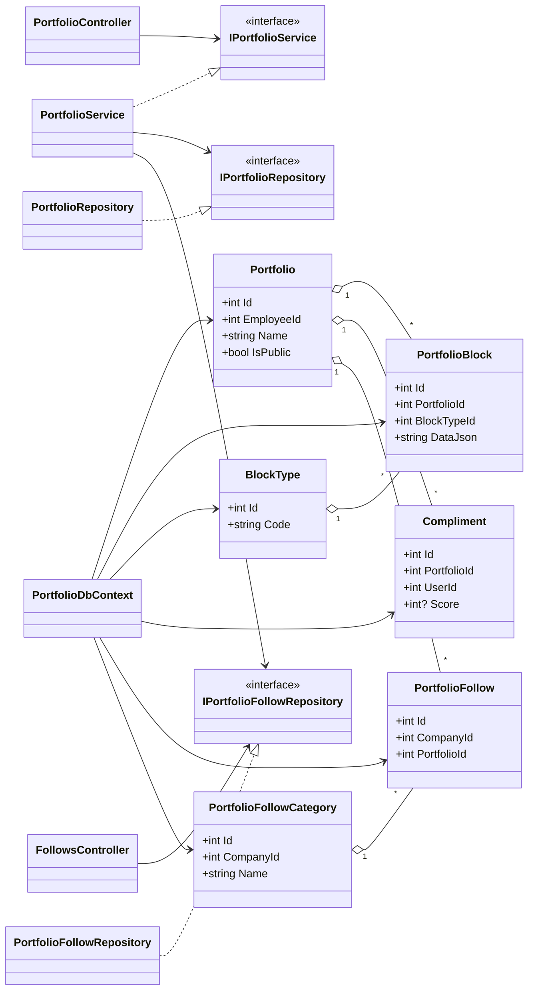

```mermaid
classDiagram
direction LR

class Portfolio {
  +int Id
  +int EmployeeId
  +string Name
  +bool IsPublic
}
class BlockType {
  +int Id
  +string Code
}
class PortfolioBlock {
  +int Id
  +int PortfolioId
  +int BlockTypeId
  +string DataJson
}
class Compliment {
  +int Id
  +int PortfolioId
  +int UserId
  +int? Score
}
class PortfolioFollow {
  +int Id
  +int CompanyId
  +int PortfolioId
}
class PortfolioFollowCategory {
  +int Id
  +int CompanyId
  +string Name
}

class PortfolioController
class FollowsController
class IPortfolioService {
  <<interface>>
}
class PortfolioService
class IPortfolioRepository {
  <<interface>>
}
class PortfolioRepository
class IPortfolioFollowRepository {
  <<interface>>
}
class PortfolioFollowRepository
class PortfolioDbContext

Portfolio "1" o-- "*" PortfolioBlock
BlockType "1" o-- "*" PortfolioBlock
Portfolio "1" o-- "*" Compliment
Portfolio "1" o-- "*" PortfolioFollow
PortfolioFollowCategory "1" o-- "*" PortfolioFollow

PortfolioController --> IPortfolioService
FollowsController --> IPortfolioFollowRepository
PortfolioService ..|> IPortfolioService
PortfolioService --> IPortfolioRepository
PortfolioService --> IPortfolioFollowRepository
PortfolioRepository ..|> IPortfolioRepository
PortfolioFollowRepository ..|> IPortfolioFollowRepository
PortfolioDbContext --> Portfolio
PortfolioDbContext --> PortfolioBlock
PortfolioDbContext --> BlockType
PortfolioDbContext --> Compliment
PortfolioDbContext --> PortfolioFollow
PortfolioDbContext --> PortfolioFollowCategory
```
