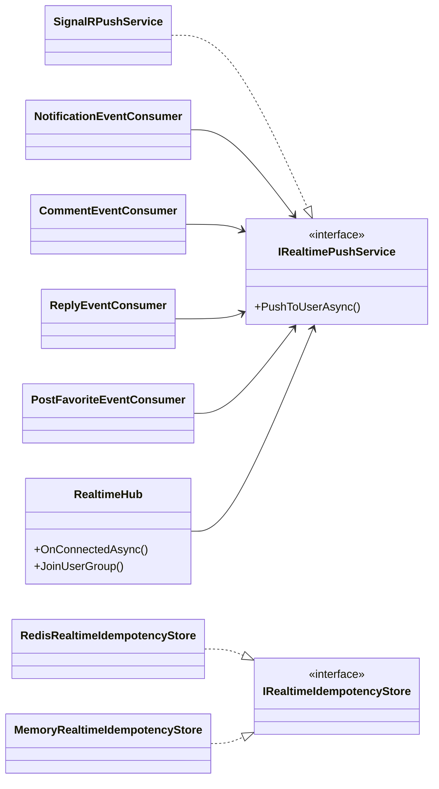

```mermaid
classDiagram
direction LR

class RealtimeHub {
  +OnConnectedAsync()
  +JoinUserGroup()
}
class IRealtimePushService {
  <<interface>>
  +PushToUserAsync()
}
class SignalRPushService
class NotificationEventConsumer
class CommentEventConsumer
class ReplyEventConsumer
class PostFavoriteEventConsumer
class IRealtimeIdempotencyStore {
  <<interface>>
}
class RedisRealtimeIdempotencyStore
class MemoryRealtimeIdempotencyStore

SignalRPushService ..|> IRealtimePushService
RedisRealtimeIdempotencyStore ..|> IRealtimeIdempotencyStore
MemoryRealtimeIdempotencyStore ..|> IRealtimeIdempotencyStore
NotificationEventConsumer --> IRealtimePushService
CommentEventConsumer --> IRealtimePushService
ReplyEventConsumer --> IRealtimePushService
PostFavoriteEventConsumer --> IRealtimePushService
RealtimeHub --> IRealtimePushService
```
