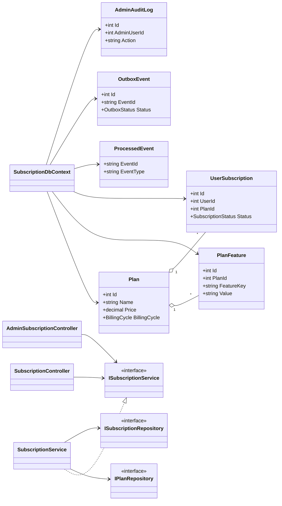

```mermaid
classDiagram
direction LR

class Plan {
  +int Id
  +string Name
  +decimal Price
  +BillingCycle BillingCycle
}
class PlanFeature {
  +int Id
  +int PlanId
  +string FeatureKey
  +string Value
}
class UserSubscription {
  +int Id
  +int UserId
  +int PlanId
  +SubscriptionStatus Status
}
class ProcessedEvent {
  +string EventId
  +string EventType
}
class OutboxEvent {
  +int Id
  +string EventId
  +OutboxStatus Status
}
class AdminAuditLog {
  +int Id
  +int AdminUserId
  +string Action
}

class SubscriptionController
class AdminSubscriptionController
class ISubscriptionService {
  <<interface>>
}
class SubscriptionService
class IPlanRepository {
  <<interface>>
}
class ISubscriptionRepository {
  <<interface>>
}
class SubscriptionDbContext

Plan "1" o-- "*" PlanFeature
Plan "1" o-- "*" UserSubscription

SubscriptionController --> ISubscriptionService
AdminSubscriptionController --> ISubscriptionService
SubscriptionService ..|> ISubscriptionService
SubscriptionService --> IPlanRepository
SubscriptionService --> ISubscriptionRepository
SubscriptionDbContext --> Plan
SubscriptionDbContext --> PlanFeature
SubscriptionDbContext --> UserSubscription
SubscriptionDbContext --> ProcessedEvent
SubscriptionDbContext --> OutboxEvent
SubscriptionDbContext --> AdminAuditLog
```
