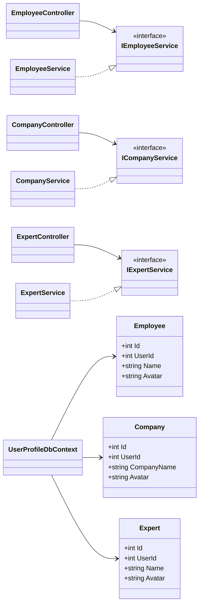

```mermaid
classDiagram
direction LR

class Employee {
  +int Id
  +int UserId
  +string Name
  +string Avatar
}

class Company {
  +int Id
  +int UserId
  +string CompanyName
  +string Avatar
}

class Expert {
  +int Id
  +int UserId
  +string Name
  +string Avatar
}

class EmployeeController
class CompanyController
class ExpertController

class IEmployeeService {
  <<interface>>
}
class ICompanyService {
  <<interface>>
}
class IExpertService {
  <<interface>>
}

class EmployeeService
class CompanyService
class ExpertService
class UserProfileDbContext

EmployeeController --> IEmployeeService
CompanyController --> ICompanyService
ExpertController --> IExpertService
EmployeeService ..|> IEmployeeService
CompanyService ..|> ICompanyService
ExpertService ..|> IExpertService
UserProfileDbContext --> Employee
UserProfileDbContext --> Company
UserProfileDbContext --> Expert
```
