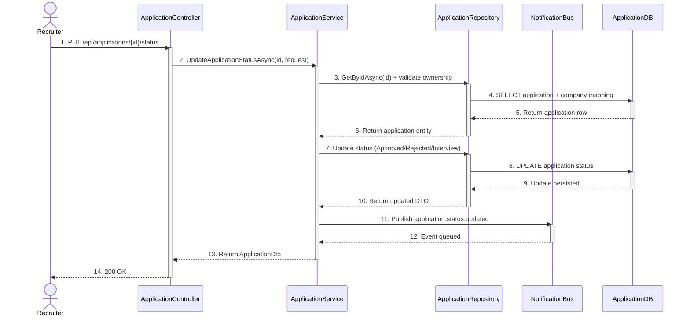

```mermaid
sequenceDiagram
    actor Recruiter
    participant ApplicationController
    participant ApplicationService
    participant ApplicationRepository
    participant NotificationBus
    participant ApplicationDB

    Recruiter->>ApplicationController: 1. PUT /api/applications/{id}/status
    activate ApplicationController
    ApplicationController->>ApplicationService: 2. UpdateApplicationStatusAsync(id, request)
    activate ApplicationService
    ApplicationService->>ApplicationRepository: 3. GetByIdAsync(id) + validate ownership
    activate ApplicationRepository
    ApplicationRepository->>ApplicationDB: 4. SELECT application + company mapping
    activate ApplicationDB
    ApplicationDB-->>ApplicationRepository: 5. Return application row
    deactivate ApplicationDB
    ApplicationRepository-->>ApplicationService: 6. Return application entity
    deactivate ApplicationRepository
    ApplicationService->>ApplicationRepository: 7. Update status (Approved/Rejected/Interview)
    activate ApplicationRepository
    ApplicationRepository->>ApplicationDB: 8. UPDATE application status
    activate ApplicationDB
    ApplicationDB-->>ApplicationRepository: 9. Update persisted
    deactivate ApplicationDB
    ApplicationRepository-->>ApplicationService: 10. Return updated DTO
    deactivate ApplicationRepository
    ApplicationService->>NotificationBus: 11. Publish application.status.updated
    activate NotificationBus
    NotificationBus-->>ApplicationService: 12. Event queued
    deactivate NotificationBus
    ApplicationService-->>ApplicationController: 13. Return ApplicationDto
    deactivate ApplicationService
    ApplicationController-->>Recruiter: 14. 200 OK
    deactivate ApplicationController
```
