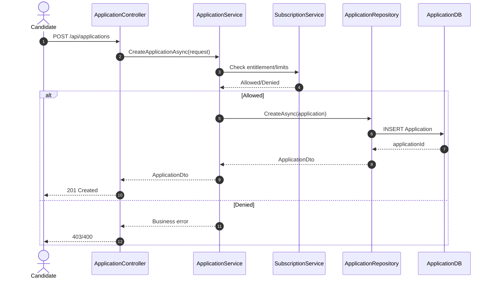

```mermaid
sequenceDiagram
    autonumber
    actor Candidate
    participant ApplicationController
    participant ApplicationService
    participant SubscriptionService
    participant ApplicationRepository
    participant ApplicationDB

    Candidate->>ApplicationController: POST /api/applications
    ApplicationController->>ApplicationService: CreateApplicationAsync(request)
    ApplicationService->>SubscriptionService: Check entitlement/limits
    SubscriptionService-->>ApplicationService: Allowed/Denied
    alt Allowed
        ApplicationService->>ApplicationRepository: CreateAsync(application)
        ApplicationRepository->>ApplicationDB: INSERT Application
        ApplicationDB-->>ApplicationRepository: applicationId
        ApplicationRepository-->>ApplicationService: ApplicationDto
        ApplicationService-->>ApplicationController: ApplicationDto
        ApplicationController-->>Candidate: 201 Created
    else Denied
        ApplicationService-->>ApplicationController: Business error
        ApplicationController-->>Candidate: 403/400
    end
```
