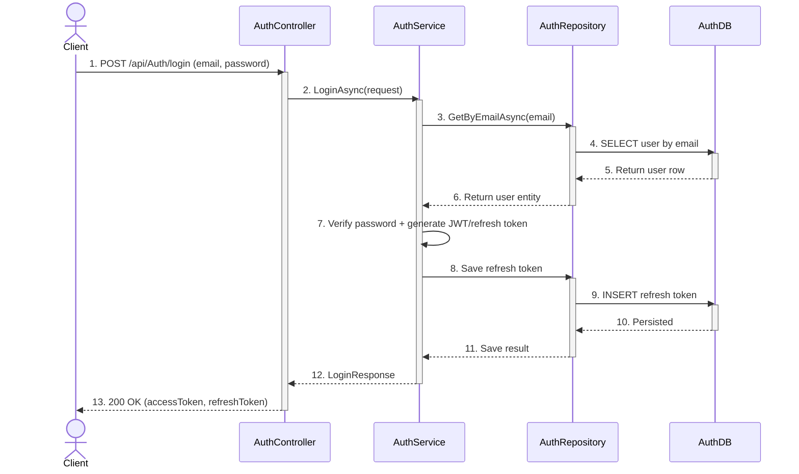

```mermaid
sequenceDiagram
    actor Client
    participant AuthController
    participant AuthService
    participant AuthRepository
    participant AuthDB

    Client->>AuthController: 1. POST /api/Auth/login (email, password)
    activate AuthController
    AuthController->>AuthService: 2. LoginAsync(request)
    activate AuthService
    AuthService->>AuthRepository: 3. GetByEmailAsync(email)
    activate AuthRepository
    AuthRepository->>AuthDB: 4. SELECT user by email
    activate AuthDB
    AuthDB-->>AuthRepository: 5. Return user row
    deactivate AuthDB
    AuthRepository-->>AuthService: 6. Return user entity
    deactivate AuthRepository
    AuthService->>AuthService: 7. Verify password + generate JWT/refresh token
    AuthService->>AuthRepository: 8. Save refresh token
    activate AuthRepository
    AuthRepository->>AuthDB: 9. INSERT refresh token
    activate AuthDB
    AuthDB-->>AuthRepository: 10. Persisted
    deactivate AuthDB
    AuthRepository-->>AuthService: 11. Save result
    deactivate AuthRepository
    AuthService-->>AuthController: 12. LoginResponse
    deactivate AuthService
    AuthController-->>Client: 13. 200 OK (accessToken, refreshToken)
    deactivate AuthController
```
