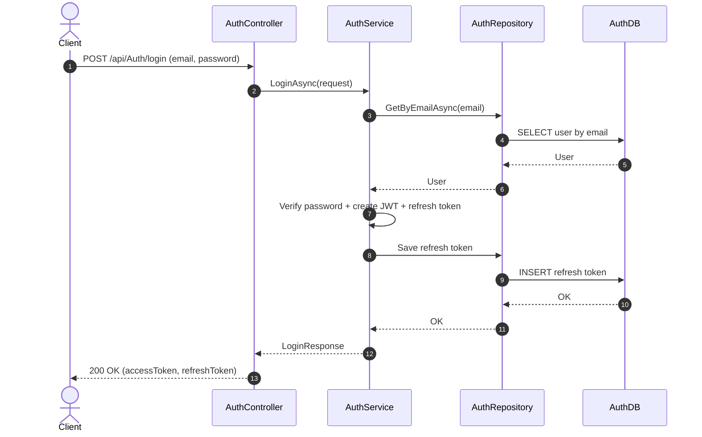

```mermaid
sequenceDiagram
    autonumber
    actor Client
    participant AuthController
    participant AuthService
    participant AuthRepository
    participant AuthDB

    Client->>AuthController: POST /api/Auth/login (email, password)
    AuthController->>AuthService: LoginAsync(request)
    AuthService->>AuthRepository: GetByEmailAsync(email)
    AuthRepository->>AuthDB: SELECT user by email
    AuthDB-->>AuthRepository: User
    AuthRepository-->>AuthService: User
    AuthService->>AuthService: Verify password + create JWT + refresh token
    AuthService->>AuthRepository: Save refresh token
    AuthRepository->>AuthDB: INSERT refresh token
    AuthDB-->>AuthRepository: OK
    AuthRepository-->>AuthService: OK
    AuthService-->>AuthController: LoginResponse
    AuthController-->>Client: 200 OK (accessToken, refreshToken)
```
