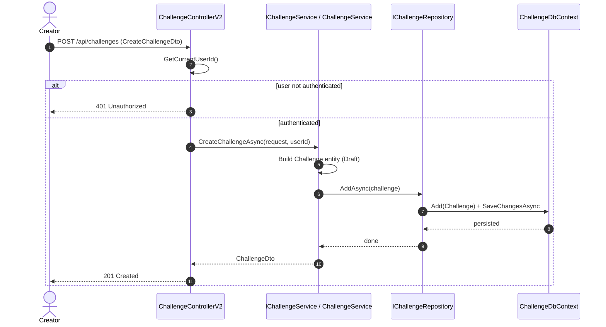
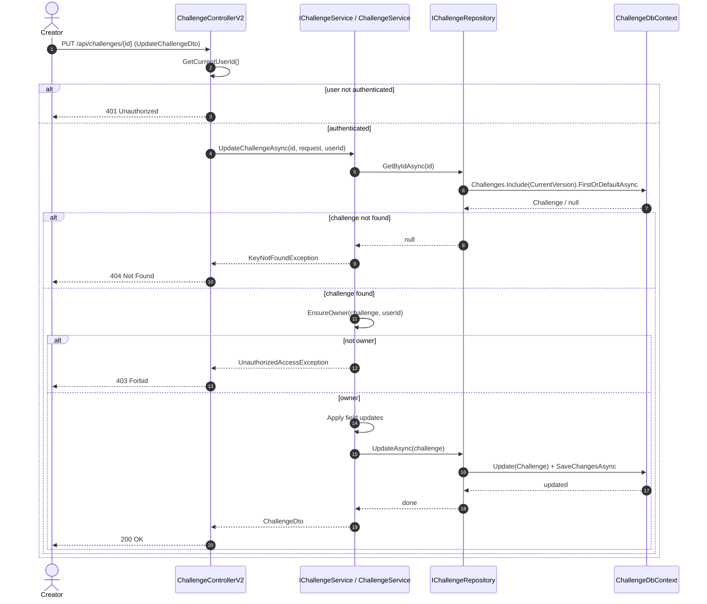
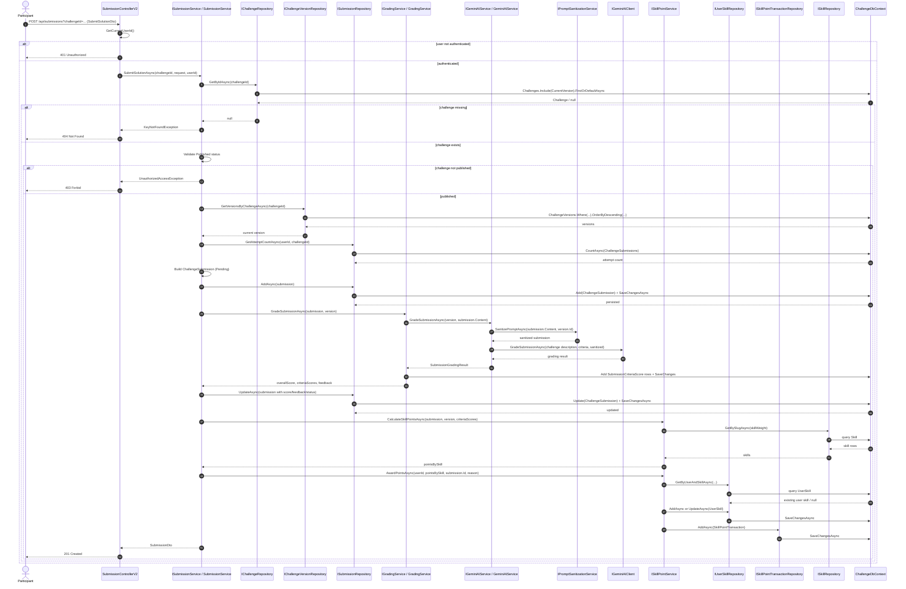
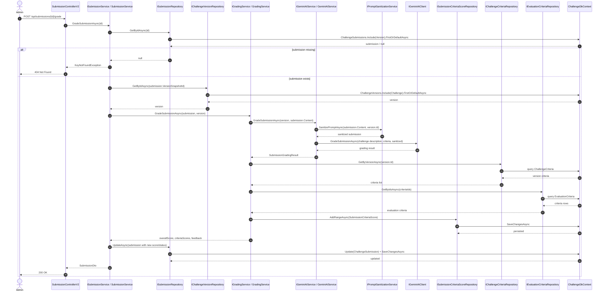

# Challenge Service Sequence Diagrams

## 1) Create challenge

```mermaid
sequenceDiagram
    autonumber
    actor U as Creator
    participant C as ChallengeControllerV2
    participant S as IChallengeService / ChallengeService
    participant R as IChallengeRepository
    participant DB as ChallengeDbContext

    U->>C: POST /api/challenges (CreateChallengeDto)
    C->>C: GetCurrentUserId()
    alt user not authenticated
        C-->>U: 401 Unauthorized
    else authenticated
        C->>S: CreateChallengeAsync(request, userId)
        S->>S: Build Challenge entity (Draft)
        S->>R: AddAsync(challenge)
        R->>DB: Add(Challenge) + SaveChangesAsync
        DB-->>R: persisted
        R-->>S: done
        S-->>C: ChallengeDto
        C-->>U: 201 Created
    end
```

## 2) Update challenge

```mermaid
sequenceDiagram
    autonumber
    actor U as Creator
    participant C as ChallengeControllerV2
    participant S as IChallengeService / ChallengeService
    participant R as IChallengeRepository
    participant DB as ChallengeDbContext

    U->>C: PUT /api/challenges/{id} (UpdateChallengeDto)
    C->>C: GetCurrentUserId()
    alt user not authenticated
        C-->>U: 401 Unauthorized
    else authenticated
        C->>S: UpdateChallengeAsync(id, request, userId)
        S->>R: GetByIdAsync(id)
        R->>DB: Challenges.Include(CurrentVersion).FirstOrDefaultAsync
        DB-->>R: Challenge / null

        alt challenge not found
            R-->>S: null
            S-->>C: KeyNotFoundException
            C-->>U: 404 Not Found
        else challenge found
            S->>S: EnsureOwner(challenge, userId)
            alt not owner
                S-->>C: UnauthorizedAccessException
                C-->>U: 403 Forbid
            else owner
                S->>S: Apply field updates
                S->>R: UpdateAsync(challenge)
                R->>DB: Update(Challenge) + SaveChangesAsync
                DB-->>R: updated
                R-->>S: done
                S-->>C: ChallengeDto
                C-->>U: 200 OK
            end
        end
    end
```

## 3) Create submission for challenge

```mermaid
sequenceDiagram
    autonumber
    actor U as Participant
    participant C as SubmissionControllerV2
    participant S as ISubmissionService / SubmissionService
    participant CR as IChallengeRepository
    participant VR as IChallengeVersionRepository
    participant SR as ISubmissionRepository
    participant G as IGradingService / GradingService
    participant AI as IGeminiAIService / GeminiAIService
    participant P as IPromptSanitizationService
    participant GC as IGeminiAIClient
    participant SP as ISkillPointService
    participant UR as IUserSkillRepository
    participant TR as ISkillPointTransactionRepository
    participant SK as ISkillRepository
    participant DB as ChallengeDbContext

    U->>C: POST /api/submissions?challengeId=... (SubmitSolutionDto)
    C->>C: GetCurrentUserId()
    alt user not authenticated
        C-->>U: 401 Unauthorized
    else authenticated
        C->>S: SubmitSolutionAsync(challengeId, request, userId)
        S->>CR: GetByIdAsync(challengeId)
        CR->>DB: Challenges.Include(CurrentVersion).FirstOrDefaultAsync
        DB-->>CR: Challenge / null

        alt challenge missing
            CR-->>S: null
            S-->>C: KeyNotFoundException
            C-->>U: 404 Not Found
        else challenge exists
            S->>S: Validate Published status
            alt challenge not published
                S-->>C: UnauthorizedAccessException
                C-->>U: 403 Forbid
            else published
                S->>VR: GetVersionsByChallengeAsync(challengeId)
                VR->>DB: ChallengeVersions.Where(...).OrderByDescending(...)
                DB-->>VR: versions
                VR-->>S: current version
                S->>SR: GetAttemptCountAsync(userId, challengeId)
                SR->>DB: CountAsync(ChallengeSubmissions)
                DB-->>SR: attempt count
                S->>S: Build ChallengeSubmission (Pending)
                S->>SR: AddAsync(submission)
                SR->>DB: Add(ChallengeSubmission) + SaveChangesAsync
                DB-->>SR: persisted
                S->>G: GradeSubmissionAsync(submission, version)
                G->>AI: GradeSubmissionAsync(version, submission.Content)
                AI->>P: SanitizePromptAsync(submission.Content, version.Id)
                P-->>AI: sanitized submission
                AI->>GC: GradeSubmissionAsync(challenge description, criteria, sanitized)
                GC-->>AI: grading result
                AI-->>G: SubmissionGradingResult
                G->>DB: Add SubmissionCriteriaScore rows + SaveChanges
                G-->>S: overallScore, criteriaScores, feedback
                S->>SR: UpdateAsync(submission with score/feedback/status)
                SR->>DB: Update(ChallengeSubmission) + SaveChangesAsync
                DB-->>SR: updated
                S->>SP: CalculateSkillPointsAsync(submission, version, criteriaScores)
                SP->>SK: GetBySlugAsync(skillWeight)
                SK->>DB: query Skill
                DB-->>SK: skill rows
                SK-->>SP: skills
                SP-->>S: pointsBySkill
                S->>SP: AwardPointsAsync(userId, pointsBySkill, submission.Id, reason)
                SP->>UR: GetByUserAndSkillAsync(...)
                UR->>DB: query UserSkill
                DB-->>UR: existing user skill / null
                SP->>UR: AddAsync or UpdateAsync(UserSkill)
                UR->>DB: SaveChangesAsync
                SP->>TR: AddAsync(SkillPointTransaction)
                TR->>DB: SaveChangesAsync
                S-->>C: SubmissionDto
                C-->>U: 201 Created
            end
        end
    end
```

## 4) Grading for user submission

```mermaid
sequenceDiagram
    autonumber
    actor A as Admin
    participant C as SubmissionControllerV2
    participant S as ISubmissionService / SubmissionService
    participant SR as ISubmissionRepository
    participant VR as IChallengeVersionRepository
    participant G as IGradingService / GradingService
    participant AI as IGeminiAIService / GeminiAIService
    participant P as IPromptSanitizationService
    participant GC as IGeminiAIClient
    participant CSR as ISubmissionCriteriaScoreRepository
    participant CR as IChallengeCriteriaRepository
    participant ER as IEvaluationCriteriaRepository
    participant DB as ChallengeDbContext

    A->>C: POST /api/submissions/{id}/grade
    C->>S: GradeSubmissionAsync(id)
    S->>SR: GetByIdAsync(id)
    SR->>DB: ChallengeSubmissions.Include(Version).FirstOrDefaultAsync
    DB-->>SR: submission / null

    alt submission missing
        SR-->>S: null
        S-->>C: KeyNotFoundException
        C-->>A: 404 Not Found
    else submission exists
        S->>VR: GetByIdAsync(submission.VersionSnapshotId)
        VR->>DB: ChallengeVersions.Include(Challenge).FirstOrDefaultAsync
        DB-->>VR: version
        VR-->>S: version
        S->>G: GradeSubmissionAsync(submission, version)
        G->>AI: GradeSubmissionAsync(version, submission.Content)
        AI->>P: SanitizePromptAsync(submission.Content, version.Id)
        P-->>AI: sanitized submission
        AI->>GC: GradeSubmissionAsync(challenge description, criteria, sanitized)
        GC-->>AI: grading result
        AI-->>G: SubmissionGradingResult
        G->>CR: GetByVersionAsync(version.Id)
        CR->>DB: query ChallengeCriteria
        DB-->>CR: version criteria
        CR-->>G: criteria list
        G->>ER: GetByIdsAsync(criteriaIds)
        ER->>DB: query EvaluationCriteria
        DB-->>ER: criteria rows
        ER-->>G: evaluation criteria
        G->>CSR: AddRangeAsync(SubmissionCriteriaScore)
        CSR->>DB: SaveChangesAsync
        DB-->>CSR: persisted
        G-->>S: overallScore, criteriaScores, feedback
        S->>SR: UpdateAsync(submission with new score/status)
        SR->>DB: Update(ChallengeSubmission) + SaveChangesAsync
        DB-->>SR: updated
        S-->>C: SubmissionDto
        C-->>A: 200 OK
    end
```
