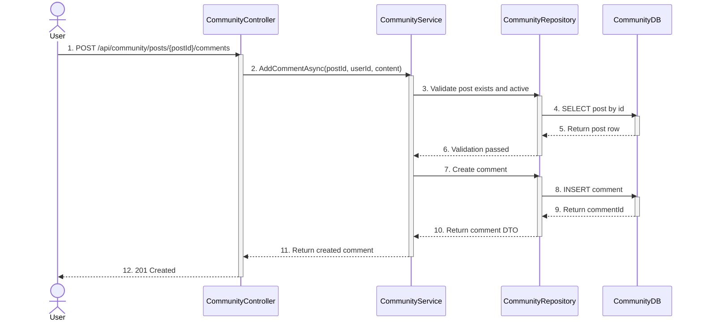

```mermaid
sequenceDiagram
    actor User
    participant CommunityController
    participant CommunityService
    participant CommunityRepository
    participant CommunityDB

    User->>CommunityController: 1. POST /api/community/posts/{postId}/comments
    activate CommunityController
    CommunityController->>CommunityService: 2. AddCommentAsync(postId, userId, content)
    activate CommunityService
    CommunityService->>CommunityRepository: 3. Validate post exists and active
    activate CommunityRepository
    CommunityRepository->>CommunityDB: 4. SELECT post by id
    activate CommunityDB
    CommunityDB-->>CommunityRepository: 5. Return post row
    deactivate CommunityDB
    CommunityRepository-->>CommunityService: 6. Validation passed
    deactivate CommunityRepository
    CommunityService->>CommunityRepository: 7. Create comment
    activate CommunityRepository
    CommunityRepository->>CommunityDB: 8. INSERT comment
    activate CommunityDB
    CommunityDB-->>CommunityRepository: 9. Return commentId
    deactivate CommunityDB
    CommunityRepository-->>CommunityService: 10. Return comment DTO
    deactivate CommunityRepository
    CommunityService-->>CommunityController: 11. Return created comment
    deactivate CommunityService
    CommunityController-->>User: 12. 201 Created
    deactivate CommunityController
```

