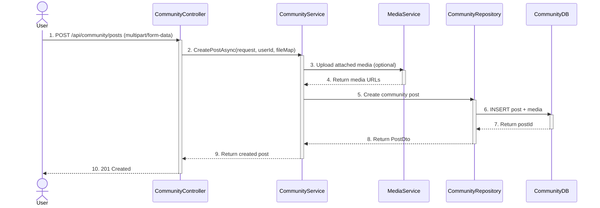

```mermaid
sequenceDiagram
    actor User
    participant CommunityController
    participant CommunityService
    participant MediaService
    participant CommunityRepository
    participant CommunityDB

    User->>CommunityController: 1. POST /api/community/posts (multipart/form-data)
    activate CommunityController
    CommunityController->>CommunityService: 2. CreatePostAsync(request, userId, fileMap)
    activate CommunityService
    CommunityService->>MediaService: 3. Upload attached media (optional)
    activate MediaService
    MediaService-->>CommunityService: 4. Return media URLs
    deactivate MediaService
    CommunityService->>CommunityRepository: 5. Create community post
    activate CommunityRepository
    CommunityRepository->>CommunityDB: 6. INSERT post + media
    activate CommunityDB
    CommunityDB-->>CommunityRepository: 7. Return postId
    deactivate CommunityDB
    CommunityRepository-->>CommunityService: 8. Return PostDto
    deactivate CommunityRepository
    CommunityService-->>CommunityController: 9. Return created post
    deactivate CommunityService
    CommunityController-->>User: 10. 201 Created
    deactivate CommunityController
```

