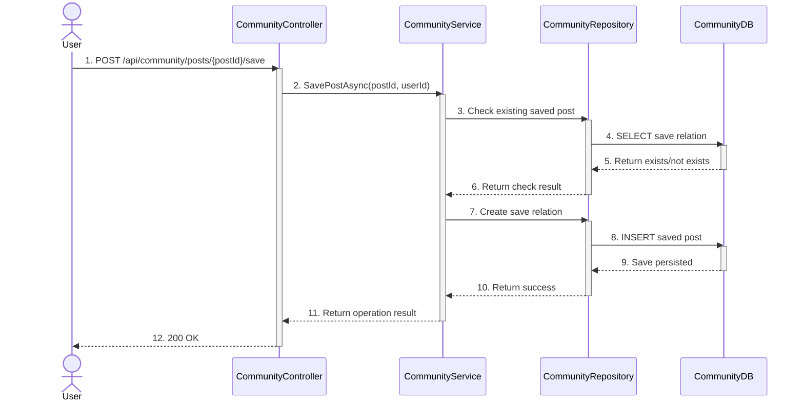

```mermaid
sequenceDiagram
    actor User
    participant CommunityController
    participant CommunityService
    participant CommunityRepository
    participant CommunityDB

    User->>CommunityController: 1. POST /api/community/posts/{postId}/save
    activate CommunityController
    CommunityController->>CommunityService: 2. SavePostAsync(postId, userId)
    activate CommunityService
    CommunityService->>CommunityRepository: 3. Check existing saved post
    activate CommunityRepository
    CommunityRepository->>CommunityDB: 4. SELECT save relation
    activate CommunityDB
    CommunityDB-->>CommunityRepository: 5. Return exists/not exists
    deactivate CommunityDB
    CommunityRepository-->>CommunityService: 6. Return check result
    deactivate CommunityRepository
    CommunityService->>CommunityRepository: 7. Create save relation
    activate CommunityRepository
    CommunityRepository->>CommunityDB: 8. INSERT saved post
    activate CommunityDB
    CommunityDB-->>CommunityRepository: 9. Save persisted
    deactivate CommunityDB
    CommunityRepository-->>CommunityService: 10. Return success
    deactivate CommunityRepository
    CommunityService-->>CommunityController: 11. Return operation result
    deactivate CommunityService
    CommunityController-->>User: 12. 200 OK
    deactivate CommunityController
```

