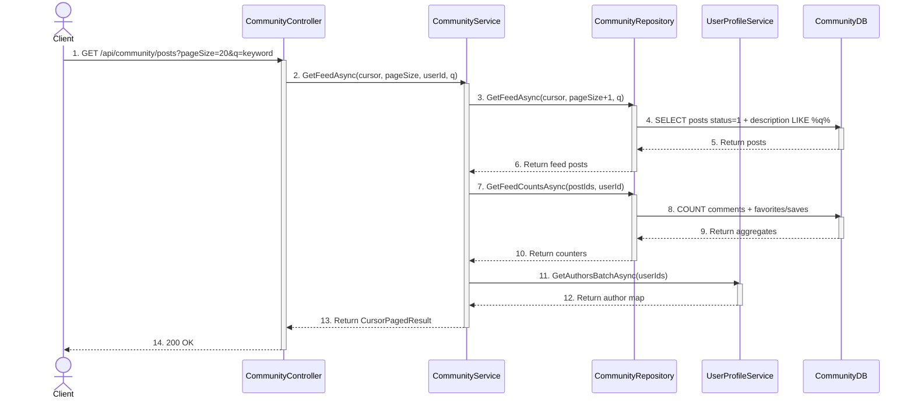

```mermaid
sequenceDiagram
    actor Client
    participant CommunityController
    participant CommunityService
    participant CommunityRepository
    participant UserProfileService
    participant CommunityDB

    Client->>CommunityController: 1. GET /api/community/posts?pageSize=20&q=keyword
    activate CommunityController
    CommunityController->>CommunityService: 2. GetFeedAsync(cursor, pageSize, userId, q)
    activate CommunityService
    CommunityService->>CommunityRepository: 3. GetFeedAsync(cursor, pageSize+1, q)
    activate CommunityRepository
    CommunityRepository->>CommunityDB: 4. SELECT posts status=1 + description LIKE %q%
    activate CommunityDB
    CommunityDB-->>CommunityRepository: 5. Return posts
    deactivate CommunityDB
    CommunityRepository-->>CommunityService: 6. Return feed posts
    deactivate CommunityRepository
    CommunityService->>CommunityRepository: 7. GetFeedCountsAsync(postIds, userId)
    activate CommunityRepository
    CommunityRepository->>CommunityDB: 8. COUNT comments + favorites/saves
    activate CommunityDB
    CommunityDB-->>CommunityRepository: 9. Return aggregates
    deactivate CommunityDB
    CommunityRepository-->>CommunityService: 10. Return counters
    deactivate CommunityRepository
    CommunityService->>UserProfileService: 11. GetAuthorsBatchAsync(userIds)
    activate UserProfileService
    UserProfileService-->>CommunityService: 12. Return author map
    deactivate UserProfileService
    CommunityService-->>CommunityController: 13. Return CursorPagedResult
    deactivate CommunityService
    CommunityController-->>Client: 14. 200 OK
    deactivate CommunityController
```
