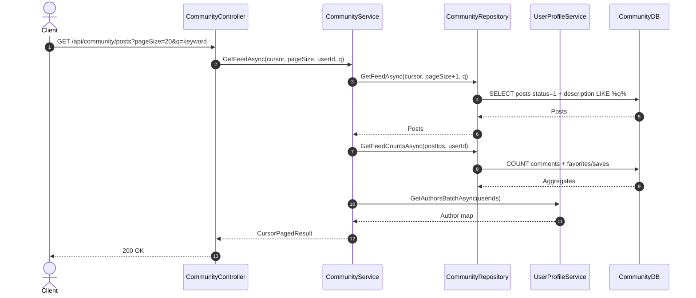

```mermaid
sequenceDiagram
    autonumber
    actor Client
    participant CommunityController
    participant CommunityService
    participant CommunityRepository
    participant UserProfileService
    participant CommunityDB

    Client->>CommunityController: GET /api/community/posts?pageSize=20&q=keyword
    CommunityController->>CommunityService: GetFeedAsync(cursor, pageSize, userId, q)
    CommunityService->>CommunityRepository: GetFeedAsync(cursor, pageSize+1, q)
    CommunityRepository->>CommunityDB: SELECT posts status=1 + description LIKE %q%
    CommunityDB-->>CommunityRepository: Posts
    CommunityRepository-->>CommunityService: Posts
    CommunityService->>CommunityRepository: GetFeedCountsAsync(postIds, userId)
    CommunityRepository->>CommunityDB: COUNT comments + favorites/saves
    CommunityDB-->>CommunityRepository: Aggregates
    CommunityService->>UserProfileService: GetAuthorsBatchAsync(userIds)
    UserProfileService-->>CommunityService: Author map
    CommunityService-->>CommunityController: CursorPagedResult
    CommunityController-->>Client: 200 OK
```
