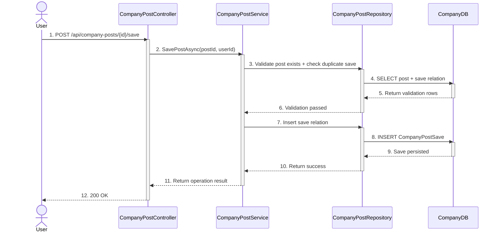

```mermaid
sequenceDiagram
    actor User
    participant CompanyPostController
    participant CompanyPostService
    participant CompanyPostRepository
    participant CompanyDB

    User->>CompanyPostController: 1. POST /api/company-posts/{id}/save
    activate CompanyPostController
    CompanyPostController->>CompanyPostService: 2. SavePostAsync(postId, userId)
    activate CompanyPostService
    CompanyPostService->>CompanyPostRepository: 3. Validate post exists + check duplicate save
    activate CompanyPostRepository
    CompanyPostRepository->>CompanyDB: 4. SELECT post + save relation
    activate CompanyDB
    CompanyDB-->>CompanyPostRepository: 5. Return validation rows
    deactivate CompanyDB
    CompanyPostRepository-->>CompanyPostService: 6. Validation passed
    deactivate CompanyPostRepository
    CompanyPostService->>CompanyPostRepository: 7. Insert save relation
    activate CompanyPostRepository
    CompanyPostRepository->>CompanyDB: 8. INSERT CompanyPostSave
    activate CompanyDB
    CompanyDB-->>CompanyPostRepository: 9. Save persisted
    deactivate CompanyDB
    CompanyPostRepository-->>CompanyPostService: 10. Return success
    deactivate CompanyPostRepository
    CompanyPostService-->>CompanyPostController: 11. Return operation result
    deactivate CompanyPostService
    CompanyPostController-->>User: 12. 200 OK
    deactivate CompanyPostController
```
