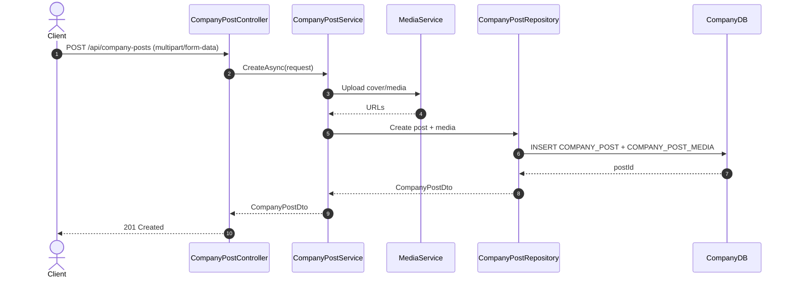

```mermaid
sequenceDiagram
    autonumber
    actor Client
    participant CompanyPostController
    participant CompanyPostService
    participant MediaService
    participant CompanyPostRepository
    participant CompanyDB

    Client->>CompanyPostController: POST /api/company-posts (multipart/form-data)
    CompanyPostController->>CompanyPostService: CreateAsync(request)
    CompanyPostService->>MediaService: Upload cover/media
    MediaService-->>CompanyPostService: URLs
    CompanyPostService->>CompanyPostRepository: Create post + media
    CompanyPostRepository->>CompanyDB: INSERT COMPANY_POST + COMPANY_POST_MEDIA
    CompanyDB-->>CompanyPostRepository: postId
    CompanyPostRepository-->>CompanyPostService: CompanyPostDto
    CompanyPostService-->>CompanyPostController: CompanyPostDto
    CompanyPostController-->>Client: 201 Created
```
