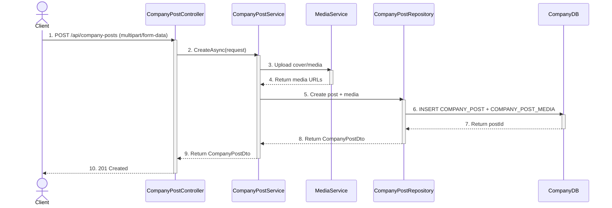

```mermaid
sequenceDiagram
    actor Client
    participant CompanyPostController
    participant CompanyPostService
    participant MediaService
    participant CompanyPostRepository
    participant CompanyDB

    Client->>CompanyPostController: 1. POST /api/company-posts (multipart/form-data)
    activate CompanyPostController
    CompanyPostController->>CompanyPostService: 2. CreateAsync(request)
    activate CompanyPostService
    CompanyPostService->>MediaService: 3. Upload cover/media
    activate MediaService
    MediaService-->>CompanyPostService: 4. Return media URLs
    deactivate MediaService
    CompanyPostService->>CompanyPostRepository: 5. Create post + media
    activate CompanyPostRepository
    CompanyPostRepository->>CompanyDB: 6. INSERT COMPANY_POST + COMPANY_POST_MEDIA
    activate CompanyDB
    CompanyDB-->>CompanyPostRepository: 7. Return postId
    deactivate CompanyDB
    CompanyPostRepository-->>CompanyPostService: 8. Return CompanyPostDto
    deactivate CompanyPostRepository
    CompanyPostService-->>CompanyPostController: 9. Return CompanyPostDto
    deactivate CompanyPostService
    CompanyPostController-->>Client: 10. 201 Created
    deactivate CompanyPostController
```
