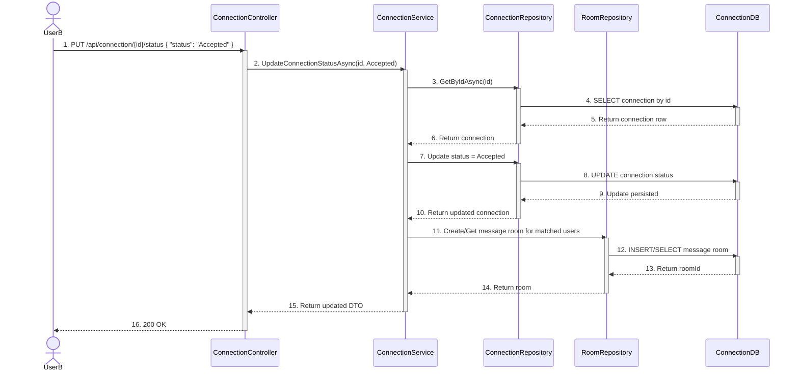

```mermaid
sequenceDiagram
    actor UserB
    participant ConnectionController
    participant ConnectionService
    participant ConnectionRepository
    participant RoomRepository
    participant ConnectionDB

    UserB->>ConnectionController: 1. PUT /api/connection/{id}/status { "status": "Accepted" }
    activate ConnectionController
    ConnectionController->>ConnectionService: 2. UpdateConnectionStatusAsync(id, Accepted)
    activate ConnectionService
    ConnectionService->>ConnectionRepository: 3. GetByIdAsync(id)
    activate ConnectionRepository
    ConnectionRepository->>ConnectionDB: 4. SELECT connection by id
    activate ConnectionDB
    ConnectionDB-->>ConnectionRepository: 5. Return connection row
    deactivate ConnectionDB
    ConnectionRepository-->>ConnectionService: 6. Return connection
    deactivate ConnectionRepository
    ConnectionService->>ConnectionRepository: 7. Update status = Accepted
    activate ConnectionRepository
    ConnectionRepository->>ConnectionDB: 8. UPDATE connection status
    activate ConnectionDB
    ConnectionDB-->>ConnectionRepository: 9. Update persisted
    deactivate ConnectionDB
    ConnectionRepository-->>ConnectionService: 10. Return updated connection
    deactivate ConnectionRepository
    ConnectionService->>RoomRepository: 11. Create/Get message room for matched users
    activate RoomRepository
    RoomRepository->>ConnectionDB: 12. INSERT/SELECT message room
    activate ConnectionDB
    ConnectionDB-->>RoomRepository: 13. Return roomId
    deactivate ConnectionDB
    RoomRepository-->>ConnectionService: 14. Return room
    deactivate RoomRepository
    ConnectionService-->>ConnectionController: 15. Return updated DTO
    deactivate ConnectionService
    ConnectionController-->>UserB: 16. 200 OK
    deactivate ConnectionController
```

