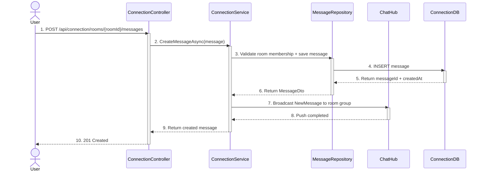

```mermaid
sequenceDiagram
    actor User
    participant ConnectionController
    participant ConnectionService
    participant MessageRepository
    participant ChatHub
    participant ConnectionDB

    User->>ConnectionController: 1. POST /api/connection/rooms/{roomId}/messages
    activate ConnectionController
    ConnectionController->>ConnectionService: 2. CreateMessageAsync(message)
    activate ConnectionService
    ConnectionService->>MessageRepository: 3. Validate room membership + save message
    activate MessageRepository
    MessageRepository->>ConnectionDB: 4. INSERT message
    activate ConnectionDB
    ConnectionDB-->>MessageRepository: 5. Return messageId + createdAt
    deactivate ConnectionDB
    MessageRepository-->>ConnectionService: 6. Return MessageDto
    deactivate MessageRepository
    ConnectionService->>ChatHub: 7. Broadcast NewMessage to room group
    activate ChatHub
    ChatHub-->>ConnectionService: 8. Push completed
    deactivate ChatHub
    ConnectionService-->>ConnectionController: 9. Return created message
    deactivate ConnectionService
    ConnectionController-->>User: 10. 201 Created
    deactivate ConnectionController
```

