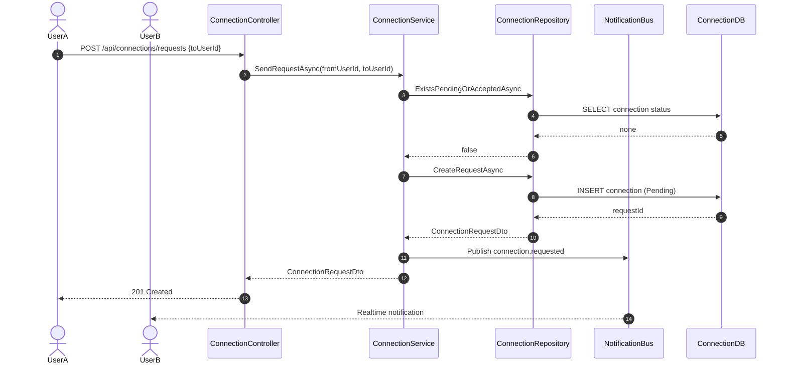

```mermaid
sequenceDiagram
    autonumber
    actor UserA
    actor UserB
    participant ConnectionController
    participant ConnectionService
    participant ConnectionRepository
    participant NotificationBus
    participant ConnectionDB

    UserA->>ConnectionController: POST /api/connections/requests {toUserId}
    ConnectionController->>ConnectionService: SendRequestAsync(fromUserId, toUserId)
    ConnectionService->>ConnectionRepository: ExistsPendingOrAcceptedAsync
    ConnectionRepository->>ConnectionDB: SELECT connection status
    ConnectionDB-->>ConnectionRepository: none
    ConnectionRepository-->>ConnectionService: false
    ConnectionService->>ConnectionRepository: CreateRequestAsync
    ConnectionRepository->>ConnectionDB: INSERT connection (Pending)
    ConnectionDB-->>ConnectionRepository: requestId
    ConnectionRepository-->>ConnectionService: ConnectionRequestDto
    ConnectionService->>NotificationBus: Publish connection.requested
    ConnectionService-->>ConnectionController: ConnectionRequestDto
    ConnectionController-->>UserA: 201 Created
    NotificationBus-->>UserB: Realtime notification
```
