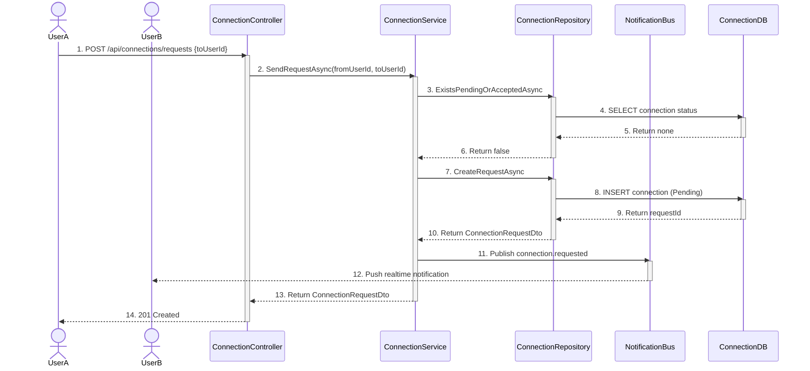

```mermaid
sequenceDiagram
    actor UserA
    actor UserB
    participant ConnectionController
    participant ConnectionService
    participant ConnectionRepository
    participant NotificationBus
    participant ConnectionDB

    UserA->>ConnectionController: 1. POST /api/connections/requests {toUserId}
    activate ConnectionController
    ConnectionController->>ConnectionService: 2. SendRequestAsync(fromUserId, toUserId)
    activate ConnectionService
    ConnectionService->>ConnectionRepository: 3. ExistsPendingOrAcceptedAsync
    activate ConnectionRepository
    ConnectionRepository->>ConnectionDB: 4. SELECT connection status
    activate ConnectionDB
    ConnectionDB-->>ConnectionRepository: 5. Return none
    deactivate ConnectionDB
    ConnectionRepository-->>ConnectionService: 6. Return false
    deactivate ConnectionRepository
    ConnectionService->>ConnectionRepository: 7. CreateRequestAsync
    activate ConnectionRepository
    ConnectionRepository->>ConnectionDB: 8. INSERT connection (Pending)
    activate ConnectionDB
    ConnectionDB-->>ConnectionRepository: 9. Return requestId
    deactivate ConnectionDB
    ConnectionRepository-->>ConnectionService: 10. Return ConnectionRequestDto
    deactivate ConnectionRepository
    ConnectionService->>NotificationBus: 11. Publish connection.requested
    activate NotificationBus
    NotificationBus-->>UserB: 12. Push realtime notification
    deactivate NotificationBus
    ConnectionService-->>ConnectionController: 13. Return ConnectionRequestDto
    deactivate ConnectionService
    ConnectionController-->>UserA: 14. 201 Created
    deactivate ConnectionController
```
