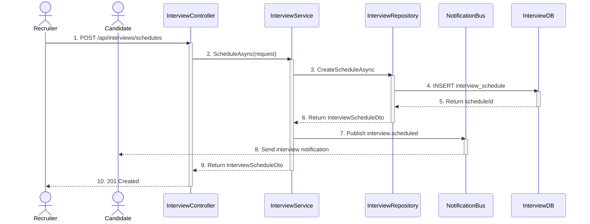

```mermaid
sequenceDiagram
    actor Recruiter
    actor Candidate
    participant InterviewController
    participant InterviewService
    participant InterviewRepository
    participant NotificationBus
    participant InterviewDB

    Recruiter->>InterviewController: 1. POST /api/interviews/schedules
    activate InterviewController
    InterviewController->>InterviewService: 2. ScheduleAsync(request)
    activate InterviewService
    InterviewService->>InterviewRepository: 3. CreateScheduleAsync
    activate InterviewRepository
    InterviewRepository->>InterviewDB: 4. INSERT interview_schedule
    activate InterviewDB
    InterviewDB-->>InterviewRepository: 5. Return scheduleId
    deactivate InterviewDB
    InterviewRepository-->>InterviewService: 6. Return InterviewScheduleDto
    deactivate InterviewRepository
    InterviewService->>NotificationBus: 7. Publish interview.scheduled
    activate NotificationBus
    NotificationBus-->>Candidate: 8. Send interview notification
    deactivate NotificationBus
    InterviewService-->>InterviewController: 9. Return InterviewScheduleDto
    deactivate InterviewService
    InterviewController-->>Recruiter: 10. 201 Created
    deactivate InterviewController
```
