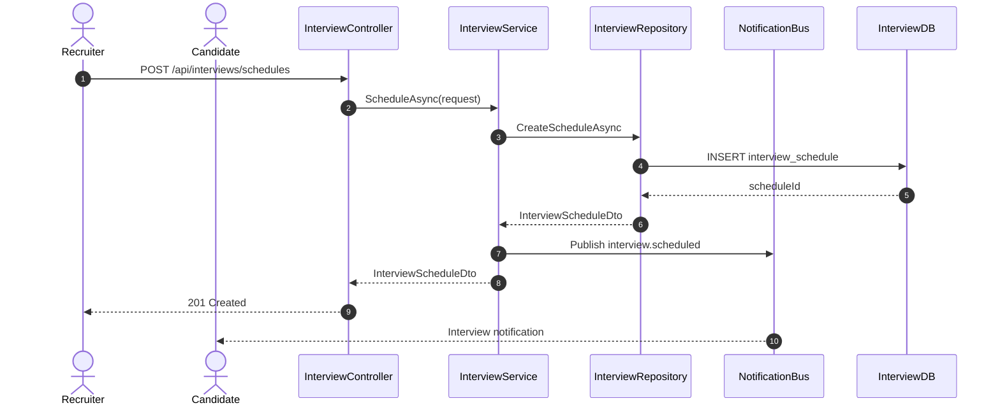

```mermaid
sequenceDiagram
    autonumber
    actor Recruiter
    actor Candidate
    participant InterviewController
    participant InterviewService
    participant InterviewRepository
    participant NotificationBus
    participant InterviewDB

    Recruiter->>InterviewController: POST /api/interviews/schedules
    InterviewController->>InterviewService: ScheduleAsync(request)
    InterviewService->>InterviewRepository: CreateScheduleAsync
    InterviewRepository->>InterviewDB: INSERT interview_schedule
    InterviewDB-->>InterviewRepository: scheduleId
    InterviewRepository-->>InterviewService: InterviewScheduleDto
    InterviewService->>NotificationBus: Publish interview.scheduled
    InterviewService-->>InterviewController: InterviewScheduleDto
    InterviewController-->>Recruiter: 201 Created
    NotificationBus-->>Candidate: Interview notification
```
