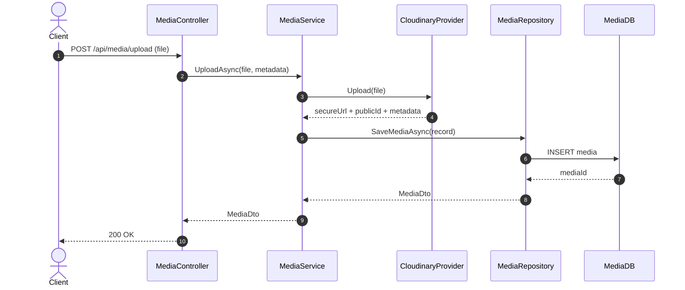

```mermaid
sequenceDiagram
    autonumber
    actor Client
    participant MediaController
    participant MediaService
    participant CloudinaryProvider
    participant MediaRepository
    participant MediaDB

    Client->>MediaController: POST /api/media/upload (file)
    MediaController->>MediaService: UploadAsync(file, metadata)
    MediaService->>CloudinaryProvider: Upload(file)
    CloudinaryProvider-->>MediaService: secureUrl + publicId + metadata
    MediaService->>MediaRepository: SaveMediaAsync(record)
    MediaRepository->>MediaDB: INSERT media
    MediaDB-->>MediaRepository: mediaId
    MediaRepository-->>MediaService: MediaDto
    MediaService-->>MediaController: MediaDto
    MediaController-->>Client: 200 OK
```
