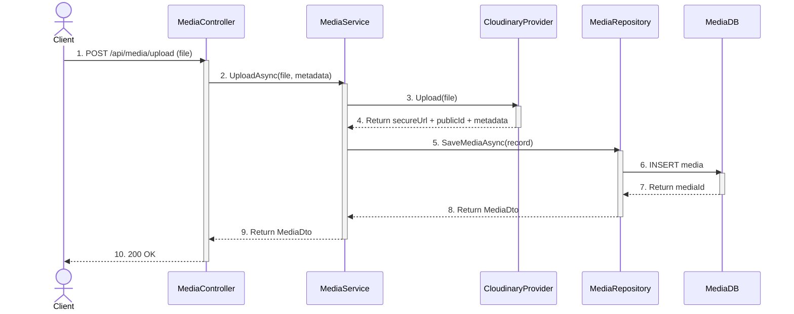

```mermaid
sequenceDiagram
    actor Client
    participant MediaController
    participant MediaService
    participant CloudinaryProvider
    participant MediaRepository
    participant MediaDB

    Client->>MediaController: 1. POST /api/media/upload (file)
    activate MediaController
    MediaController->>MediaService: 2. UploadAsync(file, metadata)
    activate MediaService
    MediaService->>CloudinaryProvider: 3. Upload(file)
    activate CloudinaryProvider
    CloudinaryProvider-->>MediaService: 4. Return secureUrl + publicId + metadata
    deactivate CloudinaryProvider
    MediaService->>MediaRepository: 5. SaveMediaAsync(record)
    activate MediaRepository
    MediaRepository->>MediaDB: 6. INSERT media
    activate MediaDB
    MediaDB-->>MediaRepository: 7. Return mediaId
    deactivate MediaDB
    MediaRepository-->>MediaService: 8. Return MediaDto
    deactivate MediaRepository
    MediaService-->>MediaController: 9. Return MediaDto
    deactivate MediaService
    MediaController-->>Client: 10. 200 OK
    deactivate MediaController
```
