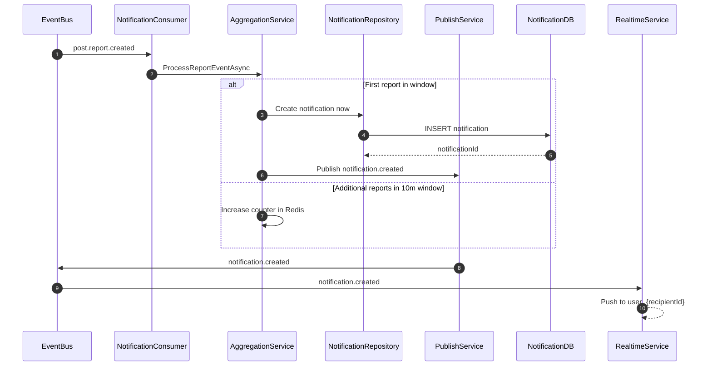

```mermaid
sequenceDiagram
    autonumber
    participant EventBus
    participant NotificationConsumer
    participant AggregationService
    participant NotificationRepository
    participant PublishService
    participant NotificationDB
    participant RealtimeService

    EventBus->>NotificationConsumer: post.report.created
    NotificationConsumer->>AggregationService: ProcessReportEventAsync
    alt First report in window
        AggregationService->>NotificationRepository: Create notification now
        NotificationRepository->>NotificationDB: INSERT notification
        NotificationDB-->>NotificationRepository: notificationId
        AggregationService->>PublishService: Publish notification.created
    else Additional reports in 10m window
        AggregationService->>AggregationService: Increase counter in Redis
    end
    PublishService->>EventBus: notification.created
    EventBus->>RealtimeService: notification.created
    RealtimeService-->>RealtimeService: Push to user_{recipientId}
```
