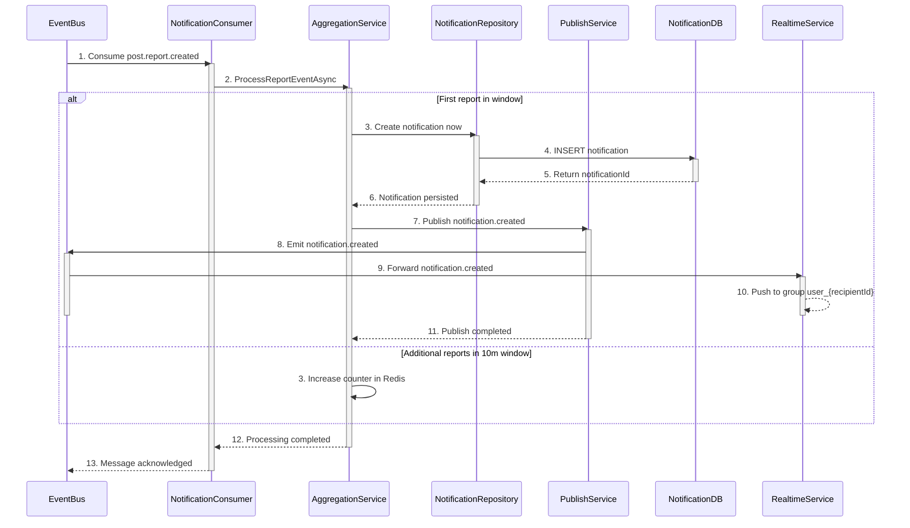

```mermaid
sequenceDiagram
    participant EventBus
    participant NotificationConsumer
    participant AggregationService
    participant NotificationRepository
    participant PublishService
    participant NotificationDB
    participant RealtimeService

    EventBus->>NotificationConsumer: 1. Consume post.report.created
    activate NotificationConsumer
    NotificationConsumer->>AggregationService: 2. ProcessReportEventAsync
    activate AggregationService
    alt First report in window
        AggregationService->>NotificationRepository: 3. Create notification now
        activate NotificationRepository
        NotificationRepository->>NotificationDB: 4. INSERT notification
        activate NotificationDB
        NotificationDB-->>NotificationRepository: 5. Return notificationId
        deactivate NotificationDB
        NotificationRepository-->>AggregationService: 6. Notification persisted
        deactivate NotificationRepository
        AggregationService->>PublishService: 7. Publish notification.created
        activate PublishService
        PublishService->>EventBus: 8. Emit notification.created
        activate EventBus
        EventBus->>RealtimeService: 9. Forward notification.created
        activate RealtimeService
        RealtimeService-->>RealtimeService: 10. Push to group user_{recipientId}
        deactivate RealtimeService
        deactivate EventBus
        PublishService-->>AggregationService: 11. Publish completed
        deactivate PublishService
    else Additional reports in 10m window
        AggregationService->>AggregationService: 3. Increase counter in Redis
    end
    AggregationService-->>NotificationConsumer: 12. Processing completed
    deactivate AggregationService
    NotificationConsumer-->>EventBus: 13. Message acknowledged
    deactivate NotificationConsumer
```
