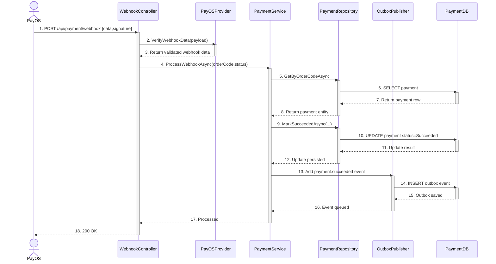

```mermaid
sequenceDiagram
    actor PayOS
    participant WebhookController
    participant PayOSProvider
    participant PaymentService
    participant PaymentRepository
    participant OutboxPublisher
    participant PaymentDB

    PayOS->>WebhookController: 1. POST /api/payment/webhook {data,signature}
    activate WebhookController
    WebhookController->>PayOSProvider: 2. VerifyWebhookData(payload)
    activate PayOSProvider
    PayOSProvider-->>WebhookController: 3. Return validated webhook data
    deactivate PayOSProvider
    WebhookController->>PaymentService: 4. ProcessWebhookAsync(orderCode,status)
    activate PaymentService
    PaymentService->>PaymentRepository: 5. GetByOrderCodeAsync
    activate PaymentRepository
    PaymentRepository->>PaymentDB: 6. SELECT payment
    activate PaymentDB
    PaymentDB-->>PaymentRepository: 7. Return payment row
    deactivate PaymentDB
    PaymentRepository-->>PaymentService: 8. Return payment entity
    deactivate PaymentRepository
    PaymentService->>PaymentRepository: 9. MarkSucceededAsync(...)
    activate PaymentRepository
    PaymentRepository->>PaymentDB: 10. UPDATE payment status=Succeeded
    activate PaymentDB
    PaymentDB-->>PaymentRepository: 11. Update result
    deactivate PaymentDB
    PaymentRepository-->>PaymentService: 12. Update persisted
    deactivate PaymentRepository
    PaymentService->>OutboxPublisher: 13. Add payment.succeeded event
    activate OutboxPublisher
    OutboxPublisher->>PaymentDB: 14. INSERT outbox event
    activate PaymentDB
    PaymentDB-->>OutboxPublisher: 15. Outbox saved
    deactivate PaymentDB
    OutboxPublisher-->>PaymentService: 16. Event queued
    deactivate OutboxPublisher
    PaymentService-->>WebhookController: 17. Processed
    deactivate PaymentService
    WebhookController-->>PayOS: 18. 200 OK
    deactivate WebhookController
```
