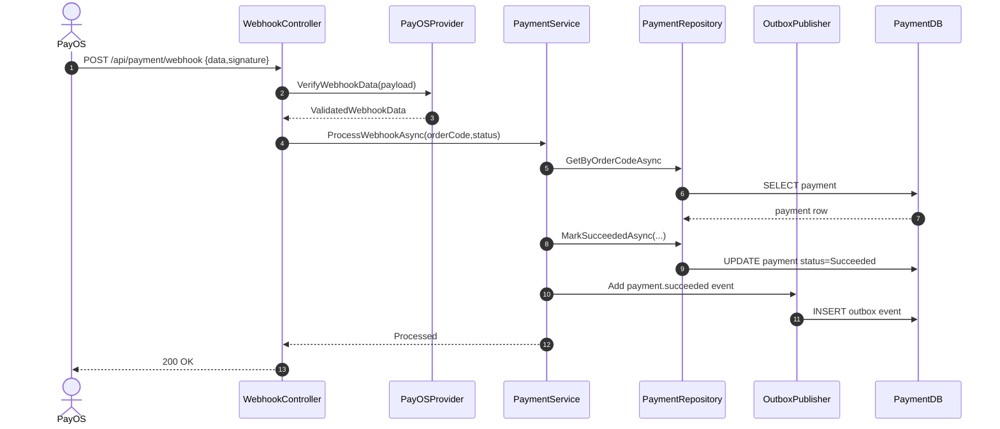

```mermaid
sequenceDiagram
    autonumber
    actor PayOS
    participant WebhookController
    participant PayOSProvider
    participant PaymentService
    participant PaymentRepository
    participant OutboxPublisher
    participant PaymentDB

    PayOS->>WebhookController: POST /api/payment/webhook {data,signature}
    WebhookController->>PayOSProvider: VerifyWebhookData(payload)
    PayOSProvider-->>WebhookController: ValidatedWebhookData
    WebhookController->>PaymentService: ProcessWebhookAsync(orderCode,status)
    PaymentService->>PaymentRepository: GetByOrderCodeAsync
    PaymentRepository->>PaymentDB: SELECT payment
    PaymentDB-->>PaymentRepository: payment row
    PaymentService->>PaymentRepository: MarkSucceededAsync(...)
    PaymentRepository->>PaymentDB: UPDATE payment status=Succeeded
    PaymentService->>OutboxPublisher: Add payment.succeeded event
    OutboxPublisher->>PaymentDB: INSERT outbox event
    PaymentService-->>WebhookController: Processed
    WebhookController-->>PayOS: 200 OK
```
