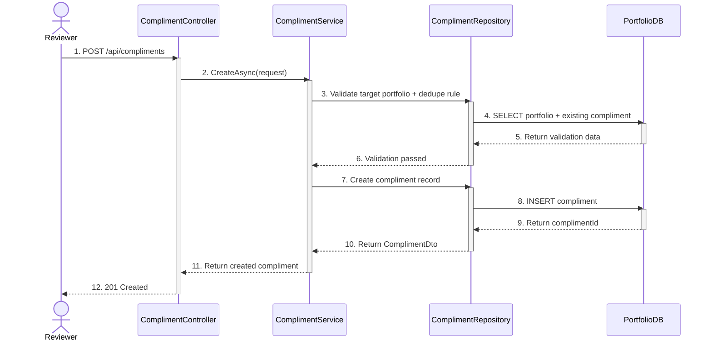

```mermaid
sequenceDiagram
    actor Reviewer
    participant ComplimentController
    participant ComplimentService
    participant ComplimentRepository
    participant PortfolioDB

    Reviewer->>ComplimentController: 1. POST /api/compliments
    activate ComplimentController
    ComplimentController->>ComplimentService: 2. CreateAsync(request)
    activate ComplimentService
    ComplimentService->>ComplimentRepository: 3. Validate target portfolio + dedupe rule
    activate ComplimentRepository
    ComplimentRepository->>PortfolioDB: 4. SELECT portfolio + existing compliment
    activate PortfolioDB
    PortfolioDB-->>ComplimentRepository: 5. Return validation data
    deactivate PortfolioDB
    ComplimentRepository-->>ComplimentService: 6. Validation passed
    deactivate ComplimentRepository
    ComplimentService->>ComplimentRepository: 7. Create compliment record
    activate ComplimentRepository
    ComplimentRepository->>PortfolioDB: 8. INSERT compliment
    activate PortfolioDB
    PortfolioDB-->>ComplimentRepository: 9. Return complimentId
    deactivate PortfolioDB
    ComplimentRepository-->>ComplimentService: 10. Return ComplimentDto
    deactivate ComplimentRepository
    ComplimentService-->>ComplimentController: 11. Return created compliment
    deactivate ComplimentService
    ComplimentController-->>Reviewer: 12. 201 Created
    deactivate ComplimentController
```

