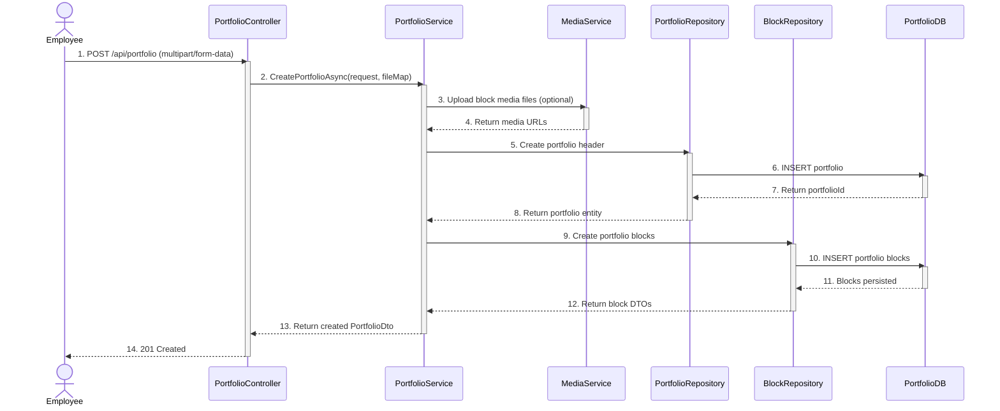

```mermaid
sequenceDiagram
    actor Employee
    participant PortfolioController
    participant PortfolioService
    participant MediaService
    participant PortfolioRepository
    participant BlockRepository
    participant PortfolioDB

    Employee->>PortfolioController: 1. POST /api/portfolio (multipart/form-data)
    activate PortfolioController
    PortfolioController->>PortfolioService: 2. CreatePortfolioAsync(request, fileMap)
    activate PortfolioService
    PortfolioService->>MediaService: 3. Upload block media files (optional)
    activate MediaService
    MediaService-->>PortfolioService: 4. Return media URLs
    deactivate MediaService
    PortfolioService->>PortfolioRepository: 5. Create portfolio header
    activate PortfolioRepository
    PortfolioRepository->>PortfolioDB: 6. INSERT portfolio
    activate PortfolioDB
    PortfolioDB-->>PortfolioRepository: 7. Return portfolioId
    deactivate PortfolioDB
    PortfolioRepository-->>PortfolioService: 8. Return portfolio entity
    deactivate PortfolioRepository
    PortfolioService->>BlockRepository: 9. Create portfolio blocks
    activate BlockRepository
    BlockRepository->>PortfolioDB: 10. INSERT portfolio blocks
    activate PortfolioDB
    PortfolioDB-->>BlockRepository: 11. Blocks persisted
    deactivate PortfolioDB
    BlockRepository-->>PortfolioService: 12. Return block DTOs
    deactivate BlockRepository
    PortfolioService-->>PortfolioController: 13. Return created PortfolioDto
    deactivate PortfolioService
    PortfolioController-->>Employee: 14. 201 Created
    deactivate PortfolioController
```

