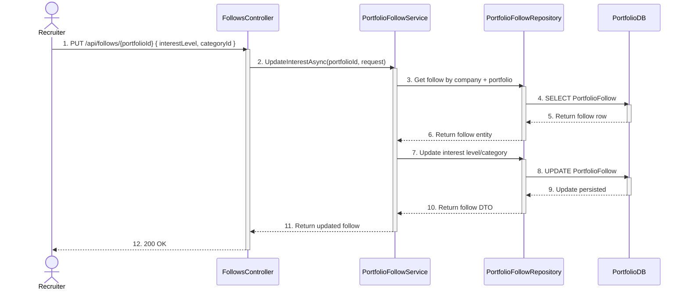

```mermaid
sequenceDiagram
    actor Recruiter
    participant FollowsController
    participant PortfolioFollowService
    participant PortfolioFollowRepository
    participant PortfolioDB

    Recruiter->>FollowsController: 1. PUT /api/follows/{portfolioId} { interestLevel, categoryId }
    activate FollowsController
    FollowsController->>PortfolioFollowService: 2. UpdateInterestAsync(portfolioId, request)
    activate PortfolioFollowService
    PortfolioFollowService->>PortfolioFollowRepository: 3. Get follow by company + portfolio
    activate PortfolioFollowRepository
    PortfolioFollowRepository->>PortfolioDB: 4. SELECT PortfolioFollow
    activate PortfolioDB
    PortfolioDB-->>PortfolioFollowRepository: 5. Return follow row
    deactivate PortfolioDB
    PortfolioFollowRepository-->>PortfolioFollowService: 6. Return follow entity
    deactivate PortfolioFollowRepository
    PortfolioFollowService->>PortfolioFollowRepository: 7. Update interest level/category
    activate PortfolioFollowRepository
    PortfolioFollowRepository->>PortfolioDB: 8. UPDATE PortfolioFollow
    activate PortfolioDB
    PortfolioDB-->>PortfolioFollowRepository: 9. Update persisted
    deactivate PortfolioDB
    PortfolioFollowRepository-->>PortfolioFollowService: 10. Return follow DTO
    deactivate PortfolioFollowRepository
    PortfolioFollowService-->>FollowsController: 11. Return updated follow
    deactivate PortfolioFollowService
    FollowsController-->>Recruiter: 12. 200 OK
    deactivate FollowsController
```

