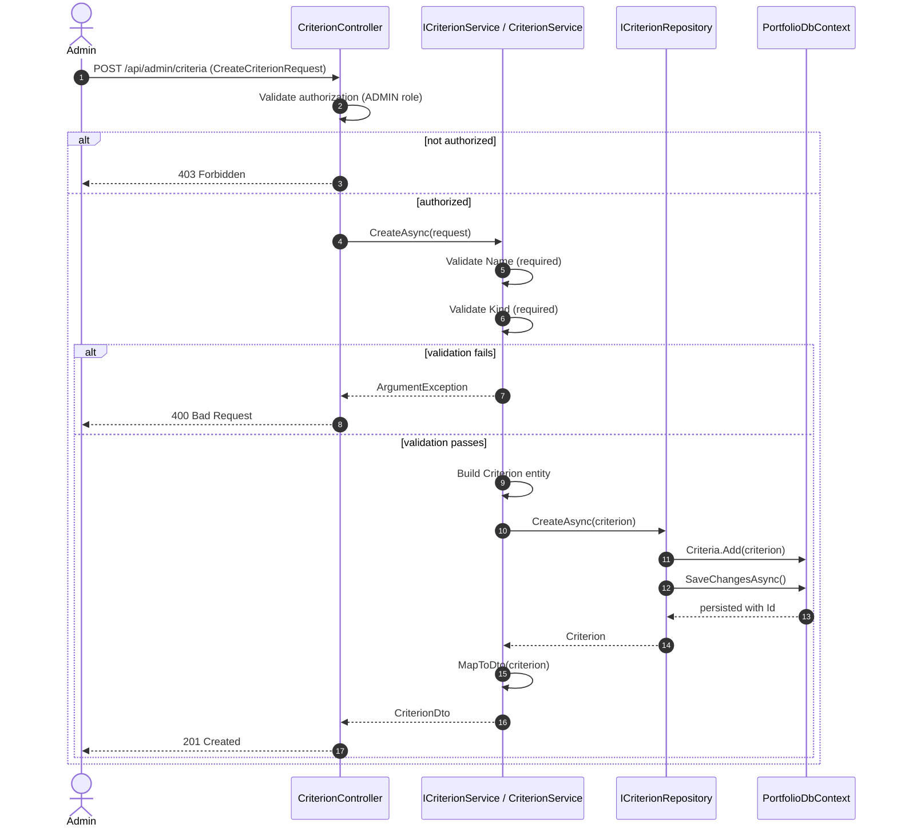
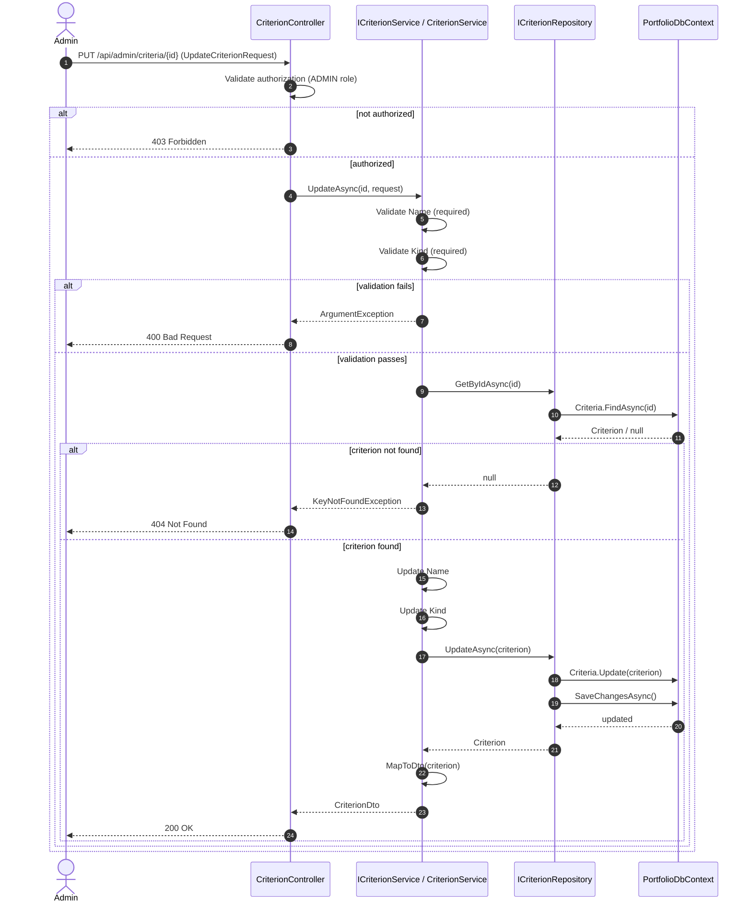

# Portfolio Service Criteria Sequence Diagrams

## 1) Create Criteria

## 2) Update Criteria

## Key Points

- **Authorization**: Only ADMIN role can create/update criteria
- **Validation**: Name and Kind are required fields
- **Persistence**: Uses PortfolioDbContext.Criteria DbSet
- **Response**: Returns CriterionDto with Id, Name, Kind, IsActive
- **Error Handling**: 
  - 400 Bad Request for validation errors
  - 403 Forbidden for authorization errors
  - 404 Not Found for missing criteria
  - 500 Internal Server Error for unexpected failures
