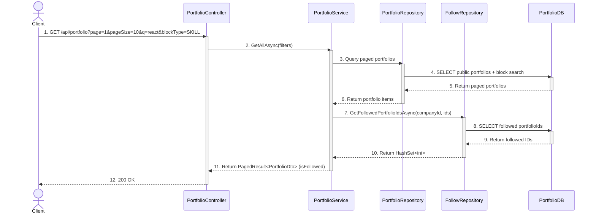

```mermaid
sequenceDiagram
    actor Client
    participant PortfolioController
    participant PortfolioService
    participant PortfolioRepository
    participant FollowRepository
    participant PortfolioDB

    Client->>PortfolioController: 1. GET /api/portfolio?page=1&pageSize=10&q=react&blockType=SKILL
    activate PortfolioController
    PortfolioController->>PortfolioService: 2. GetAllAsync(filters)
    activate PortfolioService
    PortfolioService->>PortfolioRepository: 3. Query paged portfolios
    activate PortfolioRepository
    PortfolioRepository->>PortfolioDB: 4. SELECT public portfolios + block search
    activate PortfolioDB
    PortfolioDB-->>PortfolioRepository: 5. Return paged portfolios
    deactivate PortfolioDB
    PortfolioRepository-->>PortfolioService: 6. Return portfolio items
    deactivate PortfolioRepository
    PortfolioService->>FollowRepository: 7. GetFollowedPortfolioIdsAsync(companyId, ids)
    activate FollowRepository
    FollowRepository->>PortfolioDB: 8. SELECT followed portfolioIds
    activate PortfolioDB
    PortfolioDB-->>FollowRepository: 9. Return followed IDs
    deactivate PortfolioDB
    FollowRepository-->>PortfolioService: 10. Return HashSet<int>
    deactivate FollowRepository
    PortfolioService-->>PortfolioController: 11. Return PagedResult<PortfolioDto> (isFollowed)
    deactivate PortfolioService
    PortfolioController-->>Client: 12. 200 OK
    deactivate PortfolioController
```
