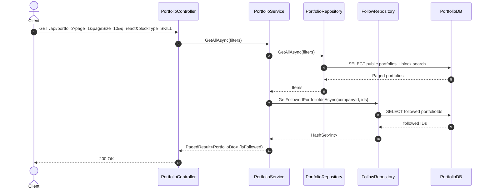

```mermaid
sequenceDiagram
    autonumber
    actor Client
    participant PortfolioController
    participant PortfolioService
    participant PortfolioRepository
    participant FollowRepository
    participant PortfolioDB

    Client->>PortfolioController: GET /api/portfolio?page=1&pageSize=10&q=react&blockType=SKILL
    PortfolioController->>PortfolioService: GetAllAsync(filters)
    PortfolioService->>PortfolioRepository: GetAllAsync(filters)
    PortfolioRepository->>PortfolioDB: SELECT public portfolios + block search
    PortfolioDB-->>PortfolioRepository: Paged portfolios
    PortfolioRepository-->>PortfolioService: Items
    PortfolioService->>FollowRepository: GetFollowedPortfolioIdsAsync(companyId, ids)
    FollowRepository->>PortfolioDB: SELECT followed portfolioIds
    PortfolioDB-->>FollowRepository: followed IDs
    FollowRepository-->>PortfolioService: HashSet<int>
    PortfolioService-->>PortfolioController: PagedResult<PortfolioDto> (isFollowed)
    PortfolioController-->>Client: 200 OK
```
