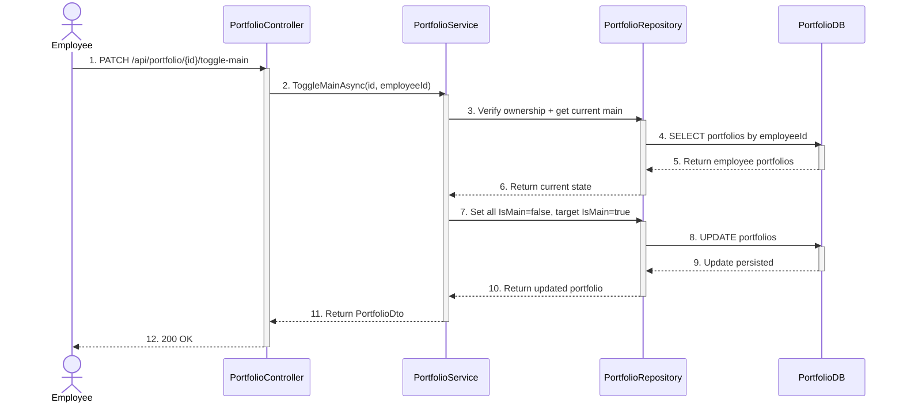

```mermaid
sequenceDiagram
    actor Employee
    participant PortfolioController
    participant PortfolioService
    participant PortfolioRepository
    participant PortfolioDB

    Employee->>PortfolioController: 1. PATCH /api/portfolio/{id}/toggle-main
    activate PortfolioController
    PortfolioController->>PortfolioService: 2. ToggleMainAsync(id, employeeId)
    activate PortfolioService
    PortfolioService->>PortfolioRepository: 3. Verify ownership + get current main
    activate PortfolioRepository
    PortfolioRepository->>PortfolioDB: 4. SELECT portfolios by employeeId
    activate PortfolioDB
    PortfolioDB-->>PortfolioRepository: 5. Return employee portfolios
    deactivate PortfolioDB
    PortfolioRepository-->>PortfolioService: 6. Return current state
    deactivate PortfolioRepository
    PortfolioService->>PortfolioRepository: 7. Set all IsMain=false, target IsMain=true
    activate PortfolioRepository
    PortfolioRepository->>PortfolioDB: 8. UPDATE portfolios
    activate PortfolioDB
    PortfolioDB-->>PortfolioRepository: 9. Update persisted
    deactivate PortfolioDB
    PortfolioRepository-->>PortfolioService: 10. Return updated portfolio
    deactivate PortfolioRepository
    PortfolioService-->>PortfolioController: 11. Return PortfolioDto
    deactivate PortfolioService
    PortfolioController-->>Employee: 12. 200 OK
    deactivate PortfolioController
```

